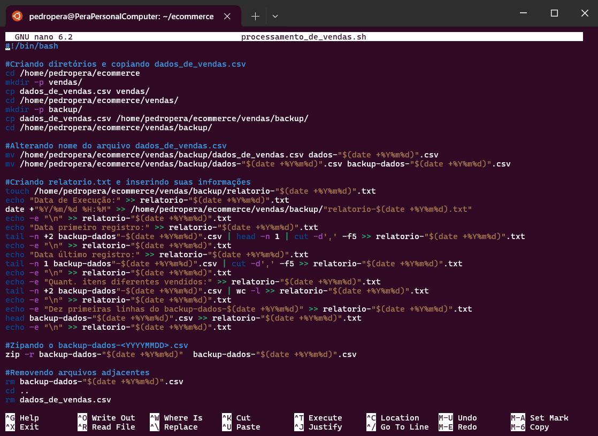
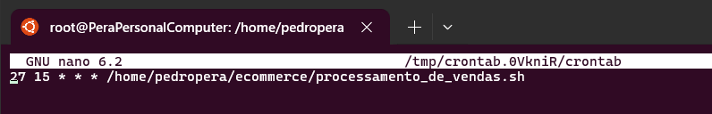
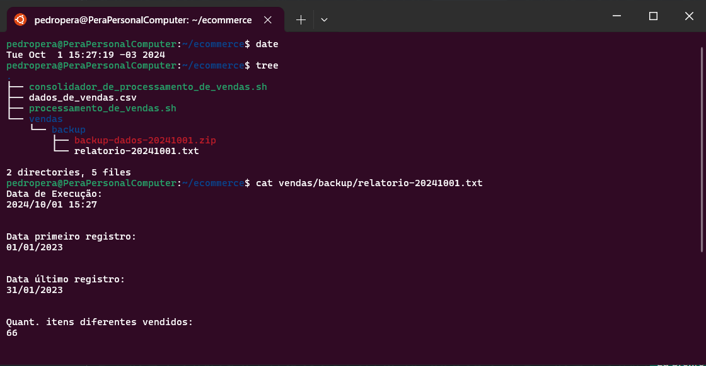
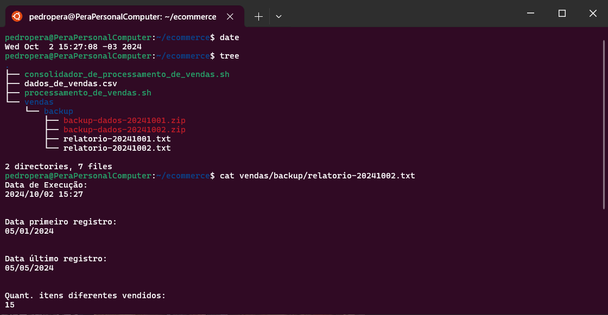
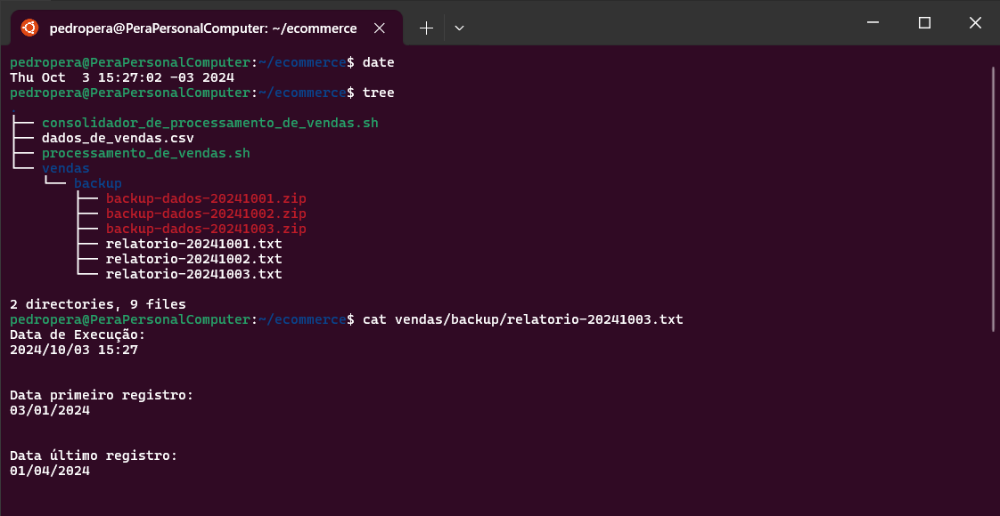
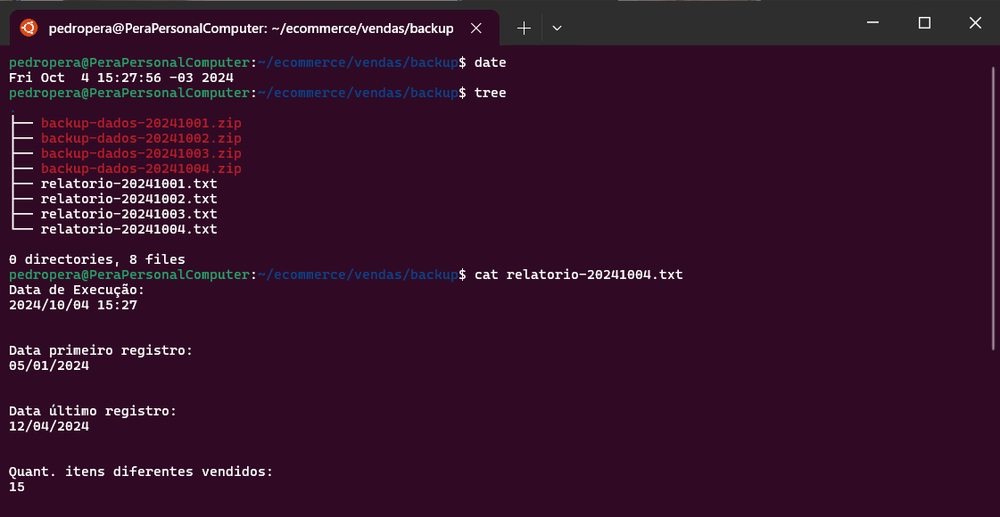
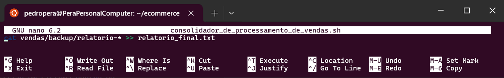

# Desafio da Sprint 1
Na primeira Sprint, recebemos o desafio de desenvolver um script que processasse e gerasse relatórios de venda com comandos shell do Linux a partir de uma base de dados. Este documento descreve todas as etapas que passei até chegar ao resultado desejado.

## 1. Preparando o espaço.
O desafio pedia que utilizássemos uma distribuição **Linux** para realizar todo o desafio, então o primeiro passo era arrumar uma forma de rodar o Linux na minha máquina.

Optei por utilizar um sistema no próprio Windows que permite rodar uma distribuição Linux, o **WSL (Windows Subsystem for Linux)**, pelo fato de consumir menos da memória do computador em relação a uma máquina virtual.

Utilizando o WSL criei o primeiro diretório dentro do meu usuário chamado ```ecommerce```. Ele seria o principal que iria abrigar todo os outros arquivos e diretórios.


Com o diretório ```ecommerce``` criado, eu movi o arquivo ```dados_de_vendas.csv```, que contém a nossa base de dados inicial, para dentro do dele.

## 2. Script
Criei então o script ```processamento_de_vendas.sh```, que realizaria todo o processamento da base de dados. Fiz isso utilizando o **nano**, um editor de texto nativo do Linux.

O script em questão precisava realizar algumas ações, que consistiam em:
- Criar um diretório ```vendas``` com um subdiretório ```backup```.
- Criar uma cópia do arquivo de dados para esses dois diretórios.
- Modificar o nome do arquivo ```.csv``` dentro do diretório ```backup``` para ```backup-dados-``` mais a data de execução no formato ```YYYYMMDD```.
- Criar um arquivo chamado ```relatorio.txt``` que contenha:
  1. Data e horário de execução.
  2. Data da primeira e última venda do arquivo ```backup-dados-<YYYYMMDD>.csv```.
  3. Quantidade de produtos diferentes do arquivo ```backup-dados-<YYYYMMDD>.csv```.
  4. 10 primeiras linhas do arquivo ```backup-dados-<YYYYMMDD>.csv```.
- Compactar o arquivo de backup em um zip.
- Excluir tanto o ```backup-dados-<YYYYMMDD>.csv``` do backup, quanto a cópia do ```dados_de_vendas.csv``` que está dentro da pasta ```vendas```.

#### Script processamento_de_vendas


## 3. Agendando Script
O desafio nos pede que o script seja executado automaticamente por **4 dias**, às exatas **15:27**.
Para isso, utilizei o crontab, um sistema de agendamento de tarefas do Linux.
Com o script devidamente criado, agendei a execução pelo usuário **root**(administrador), pois assim o script é executado com os **privilégios de administrador**, evitando qualquer problema de execução que poderia ser gerado pela falta dessas permissões.



## 4. Execução do Script
Diariamente, a partir da terça-feira, passei a abrir o terminal todos os dias em torno de 15:25, apenas aguardando o horário de execução para depois conferir se a execução foi bem sucedida.

Com a certeza de que tudo foi corretamente executado, parti para a criação de um novo arquivo ```.csv```, já que outra exigência do desafio era a necessidade de criarmos diferentes bases de dados para cada uma das execuções, emulando assim um banco de dados de vendas de um verdadeiro e-commerce.

#### Primeiro dia de execução:


#### Segundo dia de execução:


#### Terceiro dia de execução:


#### Quarto dia de execução:



## 5. Consolidação dos Relatórios
Passados os quatro dias de execução, o desafio nos pede que, a partir de um script chamado ```consolidador_de_processamento_de_vendas.sh```, juntemos todos os relatórios gerados no diretório backup em um único arquivo chamado ```relatorio_final```. 
Então criei o script de forma bem simples graças ao **wildcard** ou "*", que me permitiu inserir o relatório no arquivo relatório_final.txt mesmo com datas diferentes.

#### Script consolidador_de_processamento_de_vendas


#### Resultado da Execução:


# Conclusão
Realizar esse desafio foi algo que realmente me tirou da zona de conforto, já que nunca havia tido contato com o Linux, mas com o tempo e as aulas disponíveis, acabei pegando o jeito da coisa. 

Não tive tantas dificuldades em relação a realizar o script, o meu maior “problema” foi a falta de conhecimento mesmo! Pois algumas coisas que não foram ensinadas no curso, tive de procurar a parte na internet ou perguntando a colegas, e com essas informações em mãos, tentar encaixar no script para que realizasse aquilo que queria. Para isso, foram necessários muitas pesquisas e testes, mas fico feliz, pois acredito que consegui realizar o desafio com êxito.
