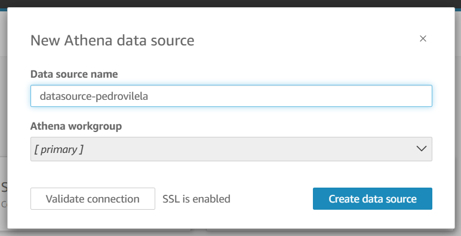
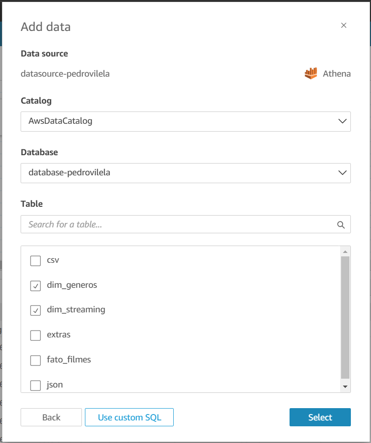
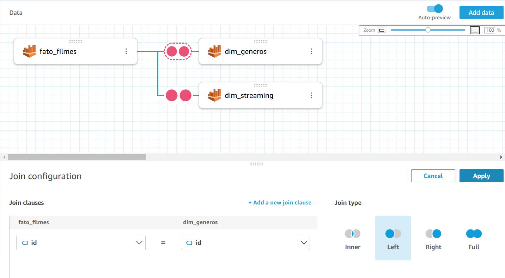
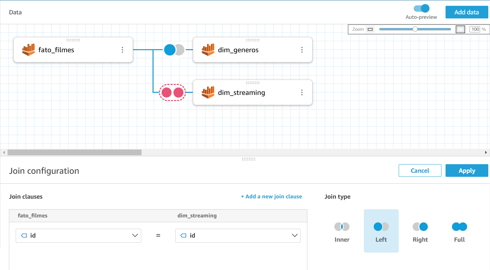
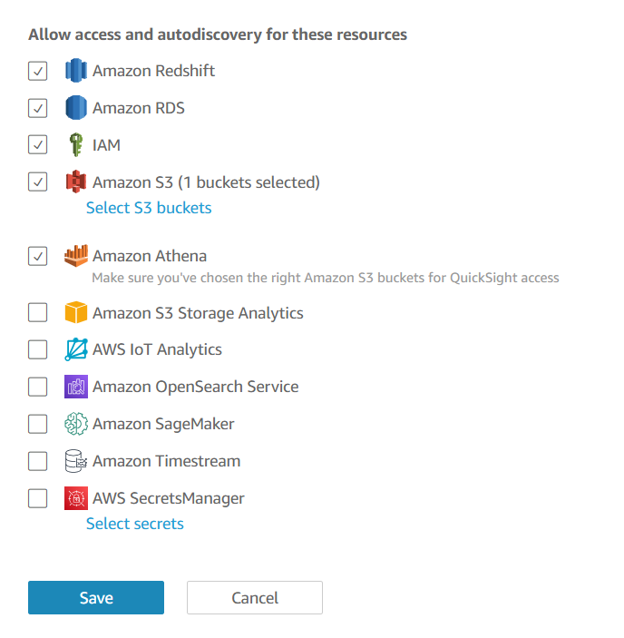
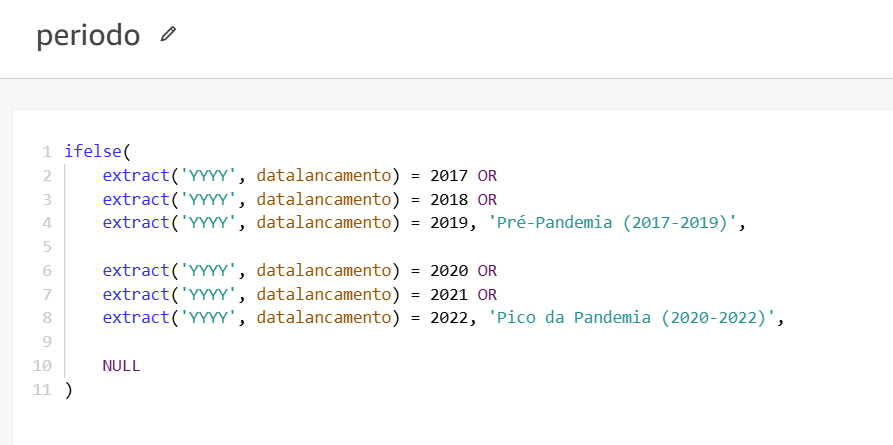
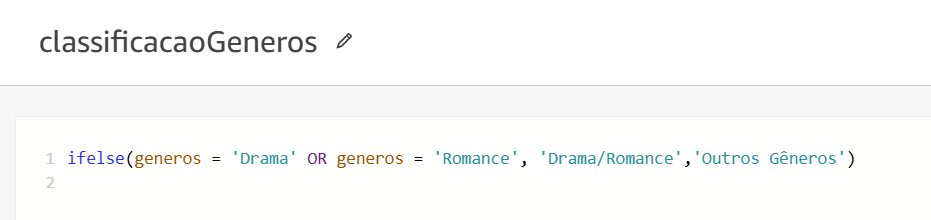

# SPRINT 10

## Exercícios
#### Não tivemos exercícios nessa sprint.

## Desafio
Nessa sprint 10 fomos responsáveis por criar um dashboard no Amazon QuickSight utilizando os dados previamente coletados e tratados para a nossa análise.

[Clique aqui!](desafio) Para ver todos os resultados e também o documento que descreve toda a jornada de como eles foram atingidos.

## Evidências

### Criando o datasource

### Adicionando a tabela ```fato_filme```

### Adicionando as dimensões

### Realizando o left join da dimensão genero

### Realizando o left join da dimensão streaming

### Atualizando as permissões do QuickSight

### Cálculo da coluna tempoProducão

### Cálculo da coluna periodo

### Cálculo da coluna classificacaoGeneros

### Filtro de filmes gerais

### Filtro de valores nulos

### Filtro de gêneros de drama e romance

### Gráfico da proporção de filmes de drama e romance entre os 20 mais populares antes e durante a pandemia.

### Mudança no tempo médio de produção dos filmes de drama e romance de 2017 a 2022.

### Variação na média das notas dos filmes de drama e romance de 2017 a 2022.

### Variação na popularidade dos filmes de drama e romance de 2017 a 2022.

### Dashboard
Para ter acesso ao dashboard [clique aqui.](desafio/dashboard.pdf)

## Certificados
#### Não tivemos certificados para essa sprint.
