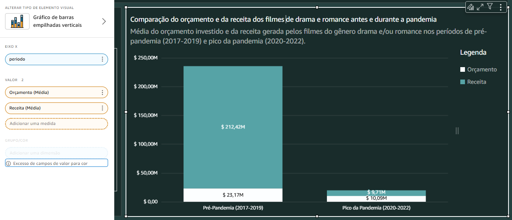

# Desafio da Sprint 10
Na nossa última sprint, tivemos a tarefa de **utilizar os dados que buscamos e tratamos para realizar um dashboard** da nossa análise utilizando a ferramenta Amazon QuickSight.

## Etapa 1
A primeira coisa que fiz foi **criar o dashsource e adicionar a tabela ```fato_filmes```** a ele. 

### Criando o datasource


### Adicionando a tabela ```fato_filme```


Com a tabela fato inserida, **adicionei as dimensões ```dim_generos``` e ```dim_streaming```** ao datasource.


Para ligar todas as tabelas, realizei um **left join** da tabela fato as suas dimensões.

### Realizando o left join da dimensão genero


### Realizando o left join da dimensão streaming


Agora, com o datasource devidamente feito, **atualizei o tipo da coluna ```dataLancamento```** para data e **dei a permissão de acesso ao S3 para o QuickSight**, permitindo que ele funcionasse corretamente.

### Atualizando as permissões do QuickSight


## Etapa 2
Com o datasource completamente configurado, **publiquei e passei para a construção da visualização**.

O meu dash **iria conter 5 gráficos** que deveriam **responder à principal pergunta da minha análise**: **Como a pandemia influenciou na indústria cinematográfica dos filmes de drama/romance.**

Para realizar cada um desses gráficos, antes necessitei de criar algumas colunas calculadas:
- ```tempoProdução```: Coluna com o tempo de produção dos filmes selecionados.


- ```periodo```: Coluna que divide os períodos de 3 anos antes do inicio da pandemia (2017-2019) e dos seus 3 anos de pico (2020-2022).


- ```classificacaoGeneros```: Coluna que separa os filmes do gênero drama/romance e agrupa todo os outros.


Além das colunas calculadas, precisei de alguns filtros:
- ```filmeGeral```: Esse filtro foi feito para separar os filmes que estavam na lista dos 20 mais populares nos períodos de pré-pandemia (2017-2019) e pico da pandemia (2020-2022)..


- ```periodo```: Filtro para retirar os valores nulos da coluna calculada ```periodo```.


- ```generos```: Filtro para separar apenas os filmes dos gêneros drama e romance.


Para responder essa pergunta trouxe 5 gráficos diferentes:
1. **Proporção de filmes de drama e romance entre os 20 mais populares antes e durante a pandemia.**
- Gráfico de pizza que mostra a porcentagem de filmes de drama/romance entre os 20 mais populares nos períodos de pré-pandemia (2017-2019) e pico da pandemia (2020-2022).


2. **Comparação do orçamento e da receita dos filmes de drama e romance antes e durante a pandemia.**
- Gráfico de barras empilhadas que compara a média de orçamento e receita dos filmes mais populares de drama e romance nos períodos analisados.



3. **Mudança no tempo médio de produção dos filmes de drama e romance de 2017 a 2022.**
- Gráfico de linhas que exibe a variação do tempo médio de produção dos filmes de drama e romance ao longo dos anos.


4. **Variação na média das notas dos filmes de drama e romance de 2017 a 2022.**
- Gráfico de linhas que mostra a evolução das notas médias dos filmes de drama e romance entre 2017 e 2022.


5. **Variação na popularidade dos filmes de drama e romance de 2017 a 2022.**
- Gráfico de barras com linhas que representa a evolução da média de popularidade dos filmes de drama e romance no TMDb ao longo dos anos.


Cada um dos gráficos possui **características dos filmes que possam ter sido influenciadas pelos eventos ocorridos na pandemia**.

Depois dos gráficos criados e trazendo as informações corretas, **organizei e estilizei o dashboard**. 

### Dashboard
**Para ter acesso ao dashboard [clique aqui.](dashboard.pdf)**

# Conclusão
Esse desafio não foi tão complexo, principalmente pelo motivo de que trabalhar com o QuickSight é bem intuitivo! A plataforma é fácil de usar e permite resultados bem satisfatórios. O problema maior foram meus dados que precisaram de uma certa alteração para que fossem trazidos corretamente para a ferramenta e gerassem os resultados de que precisava. Tirando isso, como já pontuado, a realização do desafio se desenvolveu com bastante tranquilidade.
