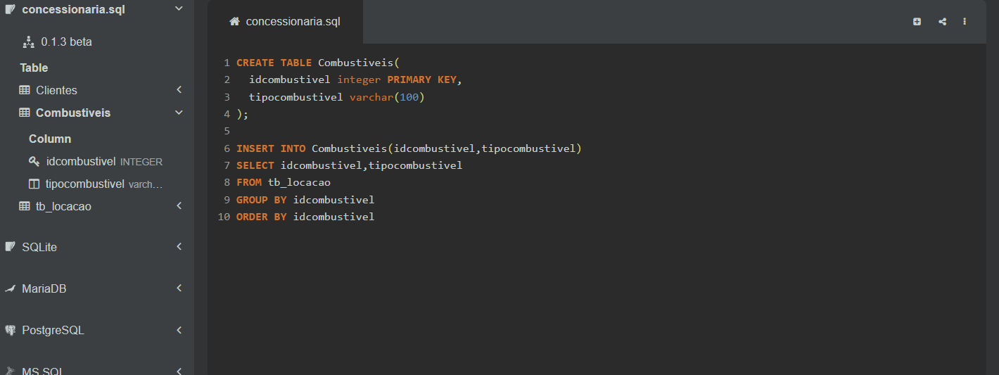
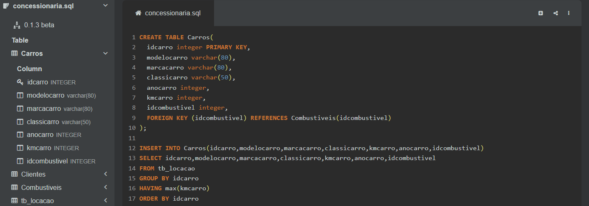
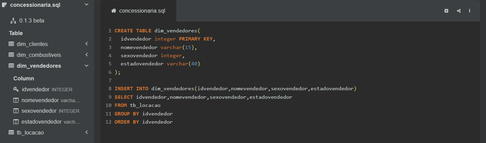
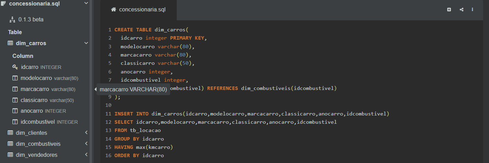
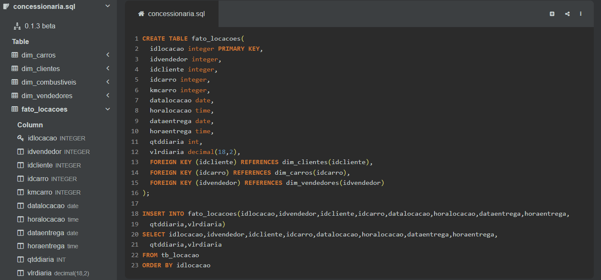
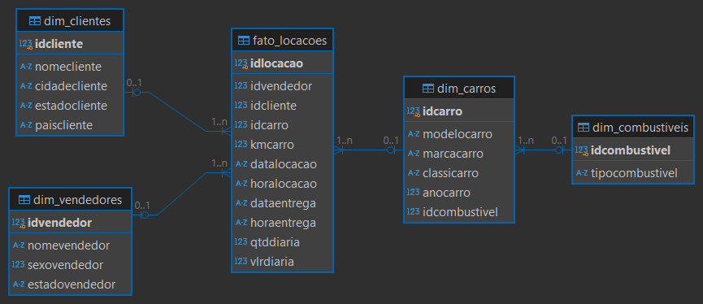

# SPRINT 2

## Exercícios

### Exercícios de query - Biblioteca (Seção 3)
- [Exercicio 01](exercicios/Ex01.sql)
- [Exercicio 02](exercicios/Ex02.sql)
- [Exercicio 03](exercicios/Ex03.sql)
- [Exercicio 04](exercicios/Ex04.sql)
- [Exercicio 05](exercicios/Ex05.sql)
- [Exercicio 06](exercicios/Ex06.sql)
- [Exercicio 07](exercicios/Ex07.sql)

### Exercícios de query - Loja (Seção 4)
- [Exercicio 08](exercicios/Ex08.sql)
- [Exercicio 09](exercicios/Ex09.sql)
- [Exercicio 10](exercicios/Ex10.sql)
- [Exercicio 11](exercicios/Ex11.sql)
- [Exercicio 12](exercicios/Ex12.sql)
- [Exercicio 13](exercicios/Ex13.sql)
- [Exercicio 14](exercicios/Ex14.sql)
- [Exercicio 15](exercicios/Ex15.sql)

### Exercícios de exportação de dados (Seção 6)
- [CSV Exportado 1](exercicios/CSV_Exportado_1.csv)
- [CSV Exportado 2](exercicios/CSV_Exportado_2.csv)

## Desafio
No desafio dessa sprint tivemos de utilizar a linguagem SQL para normalizar um banco de dados relacional, criar sua versão no modelo dimensional e ao final gerar os dois diagramas desses dois modelos finalizados.

[Clique aqui!](desafio) Para ver todos os resultados e também o documento que descreve toda a jornada de como eles foram atingidos.

## Evidências
[Clique aqui](evidencias) para ver todas as evidências da montagem e execução desse desafio.

### Normalizando banco de dados ```concessionaria```
Criei cada uma das tabelas, separando os dados da tabela original e os agrupando de acordo com seus ```atributos chaves```.






### Criando modelo dimensional
Fiz cada uma das dimensões do modelo, que, por mais idênticas, ainda alterei de lugar a coluna ```kmcarro```, para a tabela fato, já que consistia em um dado quantitativo.







### Gerando diagramas
Com os dois bancos de dados devidamente criados, utilizei o [DBeaver](https://dbeaver.io/) para gerar os dois diagramas.

### Diagrama do Modelo Relacional


### Diagrama do Modelo Dimensional


## Certificados

[AWS Partner Sales Accreditation (Business)](certificados/AWS_Partner_Sales_Accreditation_(Business)_-_Certificate.pdf)
