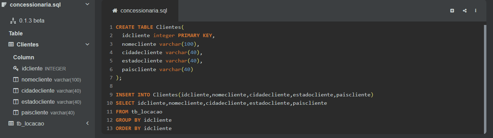
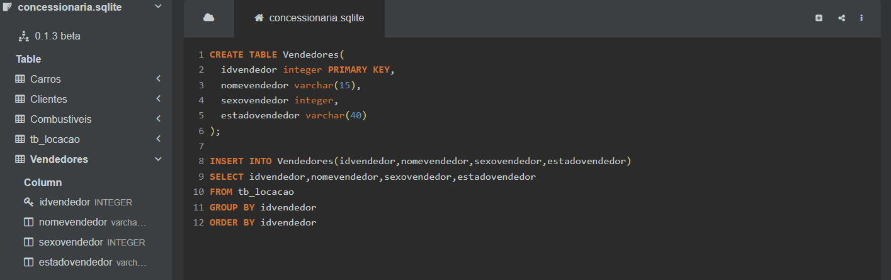
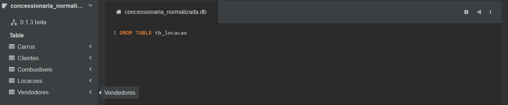
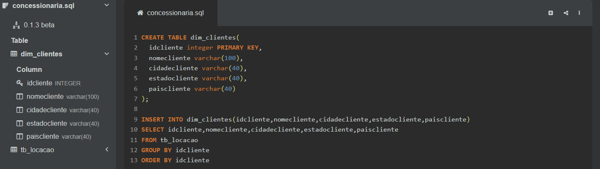
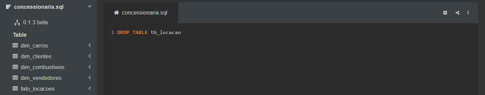

# Desafio da Sprint 2
Nessa segunda sprint, recebemos a tarefa de, utilizando a linguagem SQL, normalizar um banco de dados de uma concessionária/locadora de veículos no modelo relacional e, após normalizado, criar um modelo dimensional para facilitar a análise dos dados e, ao final, criar seus diagramas.

## 1. Preparando o espaço.
Antes de iniciar com a normalização, é importante baixar o banco e um software de gestão de banco de dados para poder manipular esse banco.

Optei por utilizar um site chamado [SQL Online IDE](https://sqliteonline.com/), que me permitia manipular o banco de dados de forma online, sem presisar baixar nada na minha máquina.

## 2. Normalização
Após subir o banco de dados da nossa concessionária/locadora para o site, eu comecei a aplicar a normalização.

O banco estava bem desorganizado pois todas as colunas estavam em uma única tabela o que gerava duas situações:
1. **Dados duplicados**

   Como todos os atributos estavam agrupados em uma tabela, havia uma repetição desnecessária e que poderia ser diminuída.
3. **Dependência de chaves compostas**

   Os atributos dependiam de mais de uma chave porque todas elas estavam na mesma tabela.

Para resolver esses problemas, comecei criando cada uma das tabelas selecionando os atributos que tinham relações entre si, removendo dessa maneira as dependências de chaves compostas. 

Defini suas chaves primárias e estrangeiras quando havia necessidade (que foi o caso das tabelas ```Locacoes``` e ```Carros```) e as utilizei como regra de agrupamento para assim remover as duplicadas, com exceção da tabela ```Locacoes```. 

Isso se deve porque, como consistia em uma tabela de registros, os dados "duplicados" não seriam um problema.

Como na minha avaliação não consegui observar nenhum caso em que fosse necessário aplicar a ```3FN```, a minha normalização estava acabada.

### Criando tabela ```Clientes```

### Criando tabela ```Vendedores```

### Criando tabela ```Combustiveis```

### Criando tabela ```Carros```

### Criando tabela ```Locacões```


E ao final "dropei" a tabela ```tb_locacao```.



## 3. Modelo Dimensional
Com o modelo relacional feito e normalizado, passei para a criação do seu modelo dimensional.

A criação do modelo dimensional foi bem simples, já que a estrutura das tabelas seguiu muito semelhante à do modelo relacional.

A única alteração foi a passagem da coluna ```kmcarro``` da dimensão ```carros``` para a tabela fato por ser um valor quantitativo.

### Criando dimensão ```dim_clientes```

### Criando dimensão ```dim_vendedores```

### Criando dimensão ```dim_combustiveis```

### Criando dimensão ```dim_carros```

### Criando tabela fato ```fato_locacões```


No fim "dropei" a tabela ```tb_locacao```.



## 4. Criando os diagramas
Para gerar os diagramas, utilizei o [DBeaver](https://dbeaver.io/) que me permitia realizar esses diagramas de forma fácil.

Bastou criar uma nova conexão SQLite e gerar os diagramas. Tive de dar um pouco mais de atenção ao diagrama do modelo dimensional, pois precisava estar no esquema em estrela. 
Além disso, modifiquei a visualização para as relações ficarem no formato pé de galinha.

### Diagrama do Modelo Relacional


### Diagrama do Modelo Dimensional


# Conclusão
Gostei bastante de utilizar o SQL para realizar as consultas e montar esse desafio. A linguagem é um pouco chata em relação às ordens das ações, mas nada que um pouco de prática não resolva. A realização do desafio em si não foi lá tão difícil, os meus problemas foram mais relacionados ao fato de estar me habituando a esse novo mundo da análise de dados, então em vários momentos acabava me esquecendo de algo crucial na criação de tabelas ou dimensões. Contudo, no geral, não tive grandes problemas com o SQL, na verdade, até gostei de utilizá-lo.
