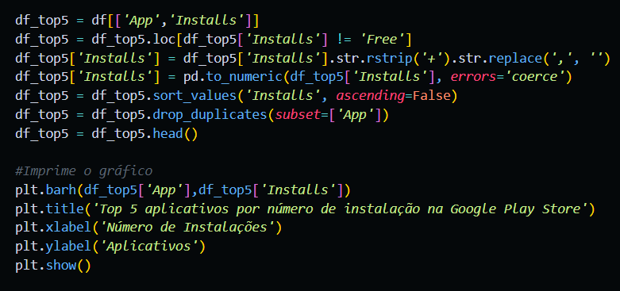
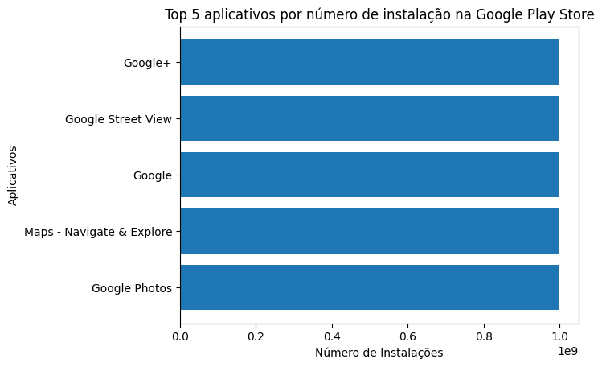

# SPRINT 3

## Exercícios

### Exercícios Python I - 1/2
- [Exercicio 01](exercicios/exercicios_1(parte1)/ex01.py)
- [Exercicio 02](exercicios/exercicios_1(parte1)/ex02.py)
- [Exercicio 03](exercicios/exercicios_1(parte1)/ex03.py)
- [Exercicio 04](exercicios/exercicios_1(parte1)/ex04.py)
- [Exercicio 05](exercicios/exercicios_1(parte1)/ex05.py)

### Exercícios Python I - 2/2
- [Exercicio 06](exercicios/exercicios_1(parte2)/ex06.py)
- [Exercicio 07](exercicios/exercicios_1(parte2)/ex07.py)
- [Exercicio 08](exercicios/exercicios_1(parte2)/ex08.py)
- [Exercicio 09](exercicios/exercicios_1(parte2)/ex09.py)
- [Exercicio 10](exercicios/exercicios_1(parte2)/ex10.py)
- [Exercicio 11](exercicios/exercicios_1(parte2)/ex11.py)
- [Exercicio 12](exercicios/exercicios_1(parte2)/ex12.py)
- [Exercicio 13](exercicios/exercicios_1(parte2)/ex13.py)
- [Exercicio 14](exercicios/exercicios_1(parte2)/ex14.py)
- [Exercicio 15](exercicios/exercicios_1(parte2)/ex15.py)
- [Exercicio 16](exercicios/exercicios_1(parte2)/ex16.py)
- [Exercicio 17](exercicios/exercicios_1(parte2)/ex17.py)
- [Exercicio 18](exercicios/exercicios_1(parte2)/ex18.py)
- [Exercicio 19](exercicios/exercicios_1(parte2)/ex19.py)
- [Exercicio 20](exercicios/exercicios_1(parte2)/ex20.py)
- [Exercicio 21](exercicios/exercicios_1(parte2)/ex21.py)
- [Exercicio 22](exercicios/exercicios_1(parte2)/ex22.py)
- [Exercicio 23](exercicios/exercicios_1(parte2)/ex23.py)
- [Exercicio 24](exercicios/exercicios_1(parte2)/ex24.py)
- [Exercicio 25](exercicios/exercicios_1(parte2)/ex25.py)

### Exercícios Python II
- [Exercício ETL - Código Etapa 1](exercicios/exercicios_2/etapa-1.py)
- [Exercício ETL - Resolução Etapa 1](exercicios/exercicios_2/etapa-1.txt)
- [Exercício ETL - Código Etapa 2](exercicios/exercicios_2/etapa-2.py)
- [Exercício ETL - Resolução Etapa 2](exercicios/exercicios_2/etapa-2.txt)
- [Exercício ETL - Código Etapa 3](exercicios/exercicios_2/etapa-3.py)
- [Exercício ETL - Resolução Etapa 3](exercicios/exercicios_2/etapa-3.txt)
- [Exercício ETL - Código Etapa 4](exercicios/exercicios_2/etapa-4.py)
- [Exercício ETL - Resolução Etapa 4](exercicios/exercicios_2/etapa-4.txt)
- [Exercício ETL - Código Etapa 5](exercicios/exercicios_2/etapa-5.py)
- [Exercício ETL - Resolução Etapa 5](exercicios/exercicios_2/etapa-5.txt)
- [Exercício ETL - Funções](exercicios/exercicios_2/funções.py)

## Desafio
No desafio dessa sprint tivemos de utilizar a linguagem python e suas bibliotecas Pandas e Matplotlib para criar calculos, consultas e gráficos a partir de uma base de dados da Google Play Store.

[Clique aqui!](desafio) Para ver todos os resultados e também o documento que descreve toda a jornada de como eles foram atingidos.

## Evidências
[Clique aqui](evidencias) para ver todas as evidências da montagem e execução desse desafio.

### Realizando cada uma das demandas do desafio

#### 1. Primeira demanda: Gráfico de barras dos Top 5 apps por número de instalação.

##### Gráfico de barras dos Top 5 apps por número de instalação.

#### 2. Segunda demanda: Gráfico de pizza mostrando a frequência de categorias dos apps.

##### Gráfico de pizza mostrando a frequência de categorias dos apps.

#### 3. Terceira demanda: App mais caro do dataframe.

#### 4. Quarta demanda: Quantidade de apps classificados como "Mature 17+" dentro do dataframe.

#### 5. Quinta demanda: Mostre uma lista com os Top 10 apps por número de reviews.

#### 6. Sexta demanda: Cálculos originais.

##### Cálculo apresentado em valor: Quantidades de aplicativos gratuitos e pagos no dataframe.

#### Cálculo apresentado em lista: Top 10 apps mais mal avaliados do dataframe.

#### Sétima demanda: Gráficos dos Cálculos.
A última coisa que nos foi pedida foi **criar dois gráficos para cada um dos cálculos** que fosse diferente dos já apresentados.

O gráfico para o cálculo apresentado como valor utiliza a lista gerada anteriormente como dados para sua criação. O tipo escolhido aqui foi o de dispersão.

Já para o cálculo exibido como lista, utilizei o tipo de gráfico de linha.

## Certificados

[AWS Aspectos econômicos da nuvem (Portugues)](certificados/AWS_Aspectos_econômicos_da_nuvem_(Portugues)_-_Certificate.pdf)

