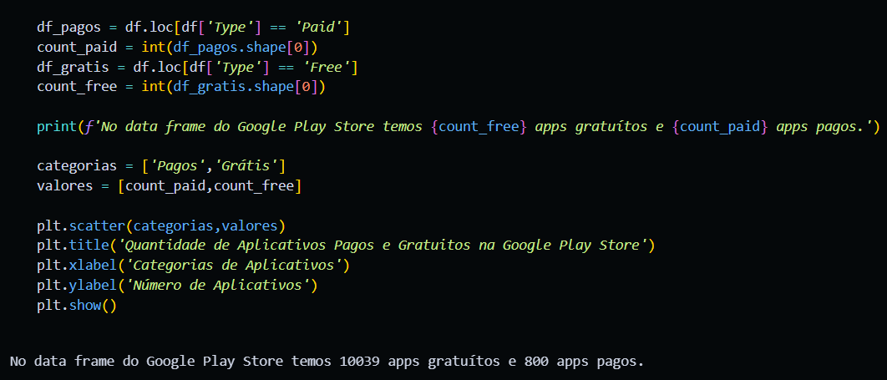

# SPRINT 1

## Exercícios

### Exercícios Python I - 1/2
- [Exercicio 01](exercicios/ex01-parte1.png)
- [Exercicio 02](exercicios/ex02-parte1.png)
- [Exercicio 03](exercicios/ex03-parte1.png)
- [Exercicio 04](exercicios/ex04-parte1.png)
- [Exercicio 05](exercicios/ex05-parte1.png)

### Exercícios Python I - 2/2
- [Exercicio 06](exercicios/ex06-parte6.png)
- [Exercicio 07](exercicios/ex07-parte7.png)
- [Exercicio 08](exercicios/ex08-parte7.png)
- [Exercicio 09](exercicios/ex09-parte7.png)
- [Exercicio 10](exercicios/ex10-parte7.png)
- [Exercicio 11](exercicios/ex11-parte7.png)
- [Exercicio 12](exercicios/ex12-parte7.png)
- [Exercicio 13](exercicios/ex13-parte7.png)
- [Exercicio 14](exercicios/ex14-parte7.png)
- [Exercicio 15](exercicios/ex15-parte7.png)
- [Exercicio 16](exercicios/ex16-parte7.png)
- [Exercicio 17](exercicios/ex17-parte7.png)
- [Exercicio 18](exercicios/ex18-parte7.png)
- [Exercicio 19](exercicios/ex19-parte7.png)
- [Exercicio 20](exercicios/ex20-parte7.png)
- [Exercicio 21](exercicios/ex21-parte7.png)
- [Exercicio 22](exercicios/ex22-parte7.png)
- [Exercicio 23](exercicios/ex23-parte7.png)
- [Exercicio 24](exercicios/ex24-parte7.png)
- [Exercicio 25](exercicios/ex25-parte7.png)

### Exercícios Python II
- [Exercício ETL - Código Etapa 1](exercicios/exETL_etapa1_code.png)
- [Exercício ETL - Resolução Etapa 1](exercicios/exETL_etapa1_resolution.png)
- [Exercício ETL - Código Etapa 2](exercicios/exETL_etapa2_code.png)
- [Exercício ETL - Resolução Etapa 2](exercicios/exETL_etapa2_resolution.png)
- [Exercício ETL - Código Etapa 3](exercicios/exETL_etapa3_code.png)
- [Exercício ETL - Resolução Etapa 3](exercicios/exETL_etapa3_resolution.png)
- [Exercício ETL - Código Etapa 4](exercicios/exETL_etapa4_code.png)
- [Exercício ETL - Resolução Etapa 4](exercicios/exETL_etapa4_resolution.png)
- [Exercício ETL - Código Etapa 5](exercicios/exETL_etapa5_code.png)
- [Exercício ETL - Resolução Etapa 5](exercicios/exETL_etapa5_resolution.png)

## Desafio
No desafio dessa sprint tivemos de utilizar a linguagem python e suas bibliotecas Pandas e Matplotlib para criar calculos, consultas e gráficos a partir de uma base de dados da Google Play Store.

[Clique aqui!](desafio) Para ver todos os resultados e também o documento que descreve toda a jornada de como eles foram atingidos.

## Evidências
[Clique aqui](evidencias) para ver todas as evidências da montagem e execução desse desafio.

### Realizando cada uma das demandas do desafio

#### 1. Primeira demanda: Gráfico de barras dos Top 5 apps por número de instalação.

##### Gráfico de barras dos Top 5 apps por número de instalação.

#### 2. Segunda demanda: Gráfico de pizza mostrando a frequência de categorias dos apps.

##### Gráfico de pizza mostrando a frequência de categorias dos apps.

#### 3. Terceira demanda: App mais caro do dataframe.

#### 4. Quarta demanda: Quantidade de apps classificados como "Mature 17+" dentro do dataframe.

#### 5. Quinta demanda: Mostre uma lista com os Top 10 apps por número de reviews.

#### 6. Sexta demanda: Cálculos originais.

##### Cálculo apresentado em valor: Quantidades de aplicativos gratuitos e pagos no dataframe.

#### Cálculo apresentado em lista: Top 10 apps mais mal avaliados do dataframe.

#### Sétima demanda: Gráficos dos Cálculos.
A última coisa que nos foi pedida foi **criar dois gráficos para cada um dos cálculos** que fosse diferente dos já apresentados.

O gráfico para o cálculo apresentado como valor utiliza a lista gerada anteriormente como dados para sua criação. O tipo escolhido aqui foi o de dispersão.

Já para o cálculo exibido como lista, utilizei o tipo de gráfico de linha.

## Certificados

[AWS Aspectos econômicos da nuvem (Portugues)](certificados/AWS_Aspectos_econômicos_da_nuvem_(Portugues)_-_Certificate.pdf)

