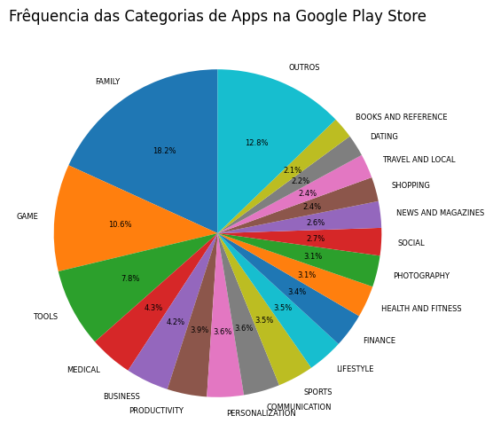
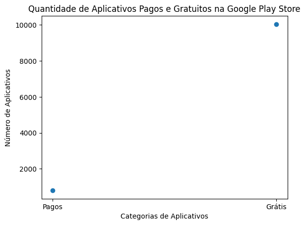
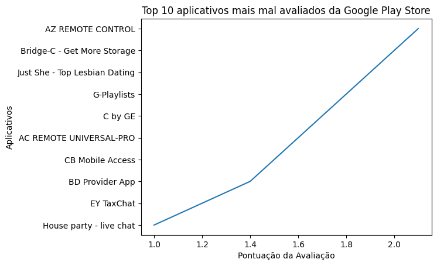

# Desafio da Sprint 3
Na Sprint 3 tivemos de realizar uma série de **cálculos, consultas e gráficos** a partir de uma base de dados utilizando **python e suas bibliotecas pandas e matplotlib**, duas bibliotecas voltadas para data science.

## 1. Preparando o espaço.
A primeira coisa a se fazer era baixar a nossa base de dados ```googleplaystore.csv``` e as bibliotecas **Pandas**, para facilitar na hora de fazer cálculos e consultas, e a **Matplotlib** que permite criar diversos gráficos a partir desses dados recolhidos.

Importei dentro do nosso notebook do Jupyter as bibliotecas e o arquivo .csv.


## Demandas.

### Primeira demanda: Gráfico de barras dos Top 5 apps por número de instalação.
A primeira coisa que tivemos de realizar foi um **gráfico com os top 10 aplicativos com mais instalações** do dataframe.
Para isso, criei um script que **separa as colunas ```App``` e ```Installs```** que **armazenam os nomes dos aplicativos e a quantindade de instalações respectivamente**. Com essas colunas em mãos, fiz um filtro que **retira uma coluna defeituosa** que apresenta seu valor no lugar errado e atrapalha o processamento dos dados, ao fim **ordeno a lista em ordem decrescente e transformo seus valores para inteiros** antes de gerar o gráfico de barras.


#### Gráfico de barras dos Top 5 apps por número de instalação.


### Segunda demanda: Gráfico de pizza mostrando a frequência de categorias dos apps.
A segunda demanda era da criação de um **gráfico de pizza que tivesse a porcentagem da frequência de aparecimento de cada uma das categorias de aplicativos**.
Criei um script que primeiro **formata a coluna ```Category``` para retirar os underlines** de seus valores, após isso ele **armazena a frequência de aparição de cada categoria** e depois **transforma esses valores em porcentagem**. Antes de gerar o gráfico, **optei por agrupar em uma única fatia os valores abaixo de 2%** para melhorar a visibilidade do gráfico.


#### Gráfico de pizza mostrando a frequência de categorias dos apps.



### Terceira demanda: App mais caro do dataframe.
Essa demanda nos pedia que informemos o **aplicativo mais caro dentro do dataframe** da Google Play Store.
Fiz um script bem simples que nos trazia essa informação, ele primeiro **armazena uma cópia do dataframe** para termos o resultado com todas as informações do aplicativo que queremos. Depois disso, ele **transforma os valores da tabela ```Price``` para inteiros** e **retira os cifrões** que atrapalham nessa conversão. Ao final, ele **ordena os valores por preço em ordem decrescente** e **exibe apenas o primeiro da lista** que corresponde ao mais caro.


### Quarta demanda: Quantidade de apps classificados como "Mature 17+" dentro do dataframe.
A quarta etapa deste desafio foi informar a **quantidade de aplicativos com a classificação indicativa "Mature 17+"** no dataframe.
Então criei um script bem simples que **localiza todas as linhas que contenham a classificação desejada** e depois **armazenei em uma variável**, e após isso coloquei **em outra variável a quantidade de linhas dessa consulta**, que consequentemente será a quantidade de apps que estão classificados com "Mature 17+" no dataframe. Por fim, **mostrei esse valor** por meio de uma mensagem de texto.


### Quinta demanda: Mostre uma lista com os Top 10 apps por número de reviews.
Aqui o trabalho era mostrar uma lista com os **top 10 aplicativos com maior número de avaliações** do dataframe.
Então montei um script que, em primeiro lugar, realiza uma **cópia das colunas ```App``` e ```Reviews```** que usaremos. Depois, **transforma os valores da coluna ```Reviews``` em inteiros** e **retira os valores duplicados da coluna ```App```**, pois, por algum motivo, temos uma repetição de alguns aplicativos com números de avaliação diferentes. Por último, ele **ordena as linhas em ordem decrescente e mostra apenas as 10 primeiras**.


### Sexta demanda: Cálculos originais.
A sexta demanda nos exigia que **criássemos nossos próprios cálculos**, onde um precisava estar em formato de lista e o outro de valor.

#### Cálculo apresentado em valor: Quantidades de aplicativos gratuitos e pagos no dataframe.
Para o cálculo apresentado em valor, decidi calcular a **quantidade de aplicativos gratuitos e pagos dentro do dataframe da Loja**, e sinceramente me surpreendi com o resultado.
O script que criei **guarda, em duas variáveis, as linhas dos jogos grátis e pagos e, em outras duas, a quantidade de cada um**. Após isso, **armazena as quantidades em uma lista** que será utilizada futuramente para a próxima demanda.


### Cálculo apresentado em lista: Top 10 apps mais mal avaliados do dataframe.
O outro cálculo que decidi fazer foi dos **top 10 aplicativos mais mal avaliados do dataframe da Loja**.
Esse script **pega os valores da coluna ```Rating``` e passa para inteiros**, depois **retira seus valores duplicados** para os resultados serem mais interessantes e variados, já que temos muitos aplicativos com as mesmas péssimas avaliações. Ao final, os **valores são ordenados em ordem crescente e apenas as 10 primeiras são mostradas**.


### Sétima demanda: Gráficos dos Cálculos.
A última coisa que nos foi pedida foi **criar dois gráficos para cada um dos cálculos** que fosse diferente dos já apresentados.

O gráfico para o cálculo apresentado como valor utiliza a lista gerada anteriormente como dados para sua criação. O tipo escolhido aqui foi o de dispersão.



Já para o cálculo exibido como lista, utilizei o tipo de gráfico de linha.



## Conclusão
Tive bastante dificuldade para realizar este desafio em relação aos outros, pois além da novidade que foram as bibliotecas, pois tive de procurar muito para realizar cada peça dos scripts. Por mais de facilitarem bastante, essas bibliotecas não são tão intuitivas de se usar e não tínhamos um curso dedicado que explicasse o básico de que precisaríamos para realizar esse desafio. Então, foi um trabalho árduo e bem cansativo, mas ao fim foi bom ver o resultado que acredito ter agradado aos requisitos de cada uma das demandas desse desafio.o tão intuítivas de se usar e não tinhamos um curso dedicado que explicasse o básico que precisariamos para realizar esse desafio. Então foi um trabalho árduo e bem cansativo, mas ao fim foi bom ver o resultado final que acredito ter agradado os requisitos de cada uma das demandas desse desafio.
