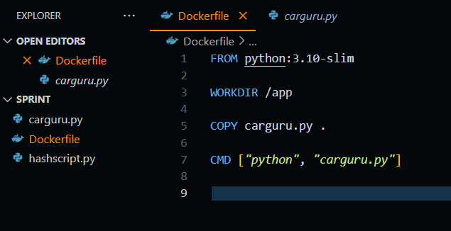
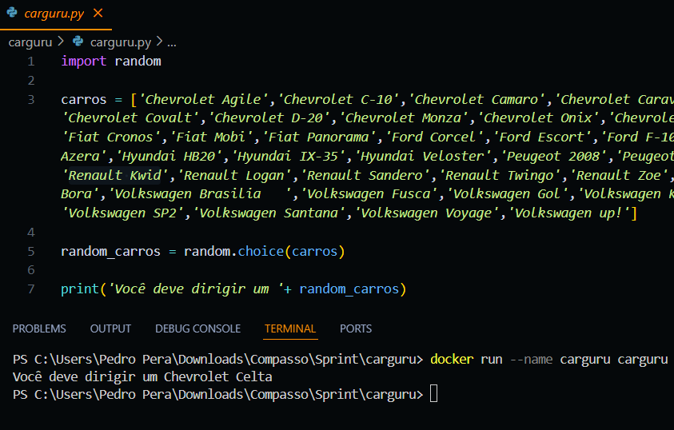
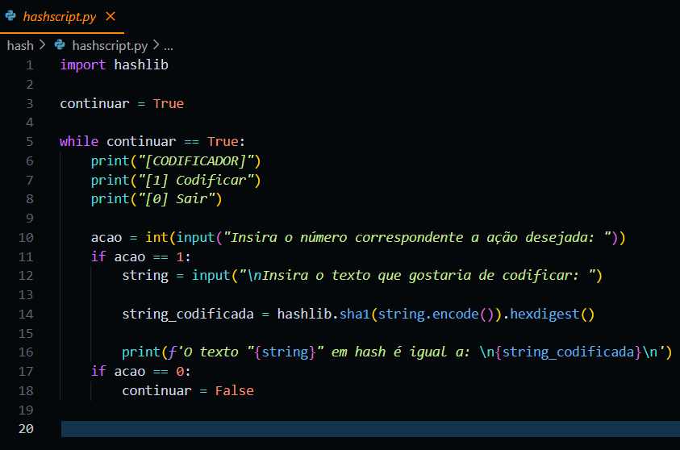
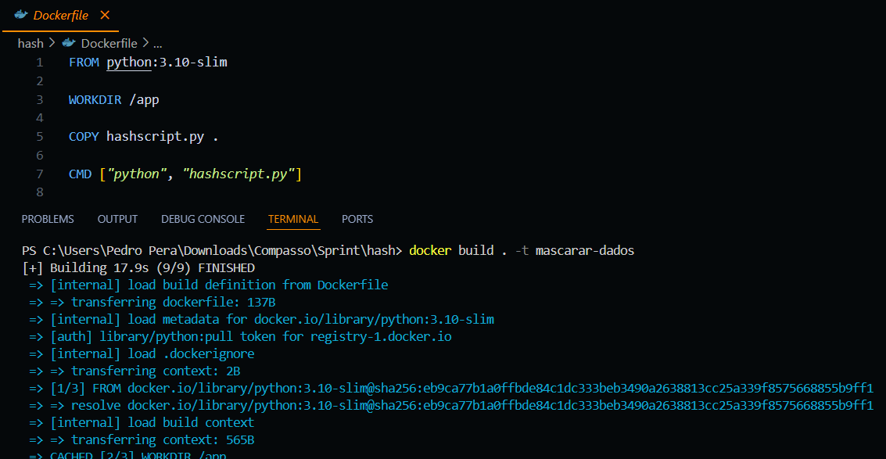
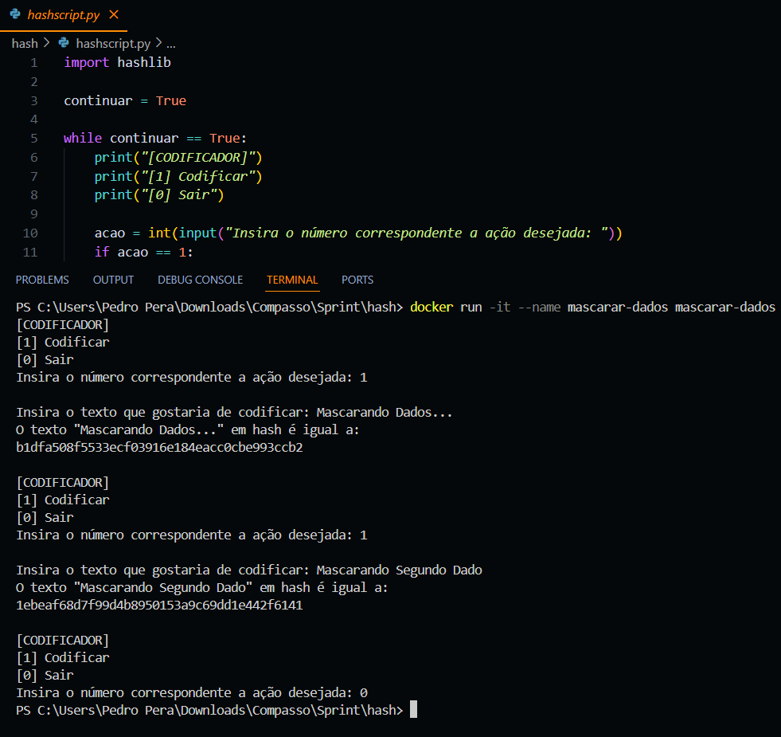

# SPRINT 3

## Exercícios

- [Exercicio 01](exercicios/ex01.py)
- [Exercicio 02](exercicios/ex02.py)
- [Exercicio 03](exercicios/ex03.py)
- [Exercicio 04](exercicios/ex04.py)
- [Exercicio 05](exercicios/ex05.py)
- [Exercicio 06](exercicios/ex06.py)
- [Exercicio 07](exercicios/ex07.py)

## Desafio
No desafio dessa sprint tivemos de utilizar do Docker para criar imagens e containers de scripts python.

[Clique aqui!](desafio) Para ver todos os resultados e também o documento que descreve toda a jornada de como eles foram atingidos.

## Evidências
[Clique aqui](evidencias) para ver todas as evidências da montagem e execução desse desafio.

### Realizando cada uma das etapas

#### Etapa 1: Criar imagem e container de script entregue.

##### Criando imagem do script carguru

##### Contruindo imagem do script carguru

##### Rodando contêiner do script carguru

#### Etapa 2: Contêiners podem ser reutilizados? A resposta é sim!

#### Etapa 3: Criando imagem, contêiner e script.

##### Script codificador

##### Criando imagem do script codificador

##### Contruindo imagem do script codificador

##### Rodando contêiner do script codificador

## Certificados

- [AWS Partner Accreditation (Technical) (Portugues)](certificados/AWS_Partner!_Accreditation_(Technical)_-_Certificate.pdf)
- [AWS Technical Essentials](certificados/AWS_Technical_Essentials_-_Certificate.pdf)
