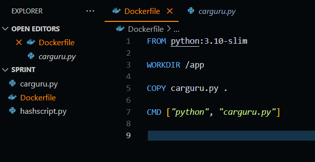
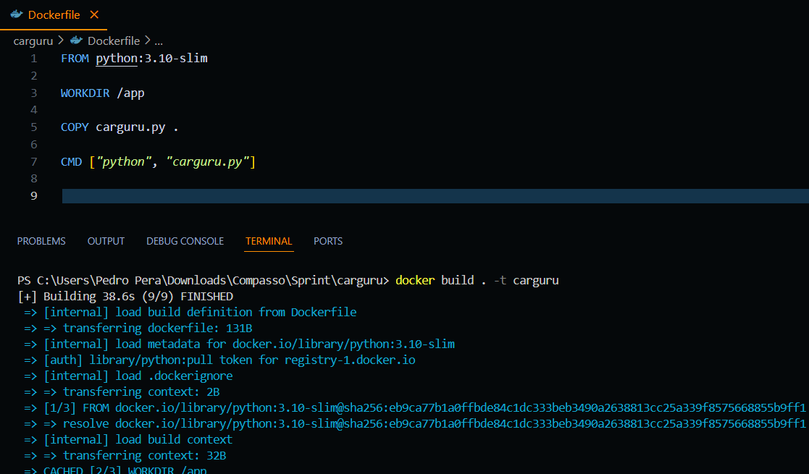
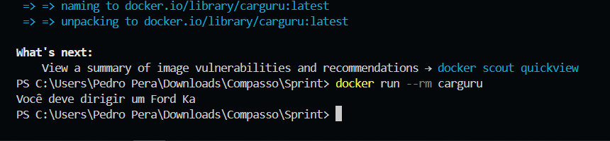

# Desafio da Sprint 4
Na nossa sprint 4, tivemos de utilizar o Docker para criar imagens e contêineres de dois scripts Python. O primeiro script foi entregue no desafio e o outro tivemos de criar do zero.

## Preparando o Espaço
Antes de começar a fazer o desafio em si, tive de instalar o Docker e as extensões do VS Code. Com isso feito, baixei o script Python e agora o campo estará pronto para começarmos.

## Etapa 1
A primeira etapa nos pedia que criássemos a imagem e o contêiner do script carguru.py.

Criei um Dockerfile que utiliza a imagem base do Python 3 slim, por ser mais leve, defini o diretório de trabalho como /app e copiei o script para dentro dela, por fim coloquei os comandos que seriam digitados quando a imagem for executada para que o script funcionasse.

Depois contrui a imagem com o comando docker build -t carguru (a flag -t serve para que eu possa nomear a imagem).

Depois rodei a imagem dentro de um contêiner com o comando docker run --name carguru carguru (a flag --name para dar nome ao contêiner) e recebi o resultado, que no caso, era uma mensagem aleatória que me diria qual carro eu vou dirigir. 

## Etapa 2 
A segunda etapa era uma pergunta sobre se era possível reutilizar contêineres e a resposta para isso é sim! É possível reiniciar contêineres usando o comando docker start <id do contêiner>.

## Etapa 3
A terceira e última etapa tinha as mesmas demandas de criar uma imagem e um contêiner de um script, mas o script dessa vez precisaria ser feito do zero, no caso, era um script de codificação de mensagens no formato hash SHA1.

O meu código inicia com um simples menu que te permite escolher entre codificar uma mensagem e sair do script. Caso sua escolha seja codificar uma mensagem, ele te pedirá a mensagem, codificará, imprimirá a mensagem codificada na tela e voltará para o menu. 

Com o código feito e rodando, simplesmente fiz a Dockerfile, que é idêntica à da primeira etapa, mudando apenas o nome do script no CMD.
Após ter a imagem feita, a construí com o nome de mascarar-dados (uma exigência do desafio) e rodei o contêiner no modo interativo para poder escrever as mensagens.

## Conclusão
O desafio desse sprint foi um dos mais tranquilos até o momento, tive que apanhar um pouco para poder aprender como se usava os comandos devidamente, mas após aprendido tudo fluiu rápido. A única parte ruim desse desafio foi o programa do Docker desktop ser um pouco pesado, o que atrapalhava um pouco, mas tirando isso, não tive mais nenhum problema e acredito ter finalizado todo o desafio com êxito.
