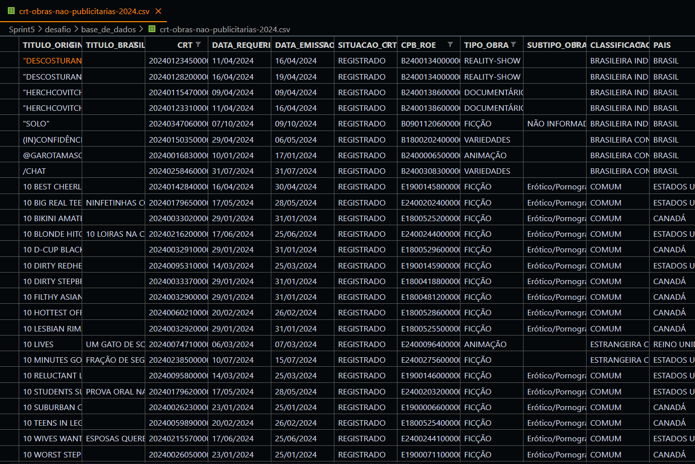
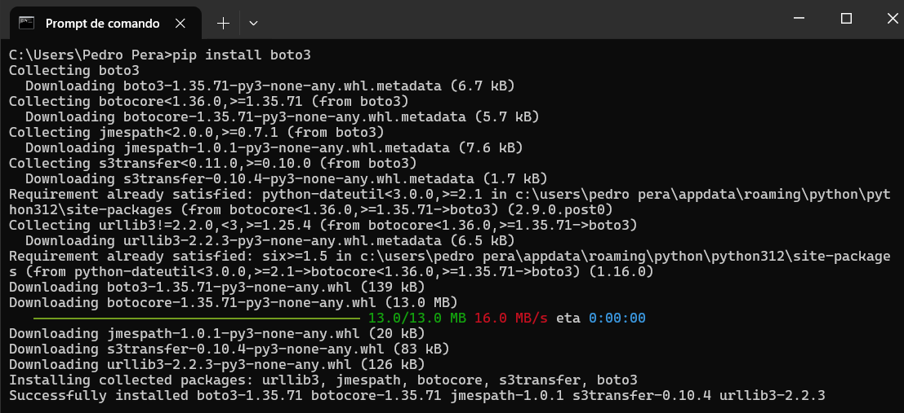
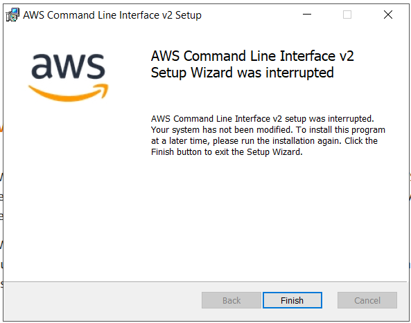
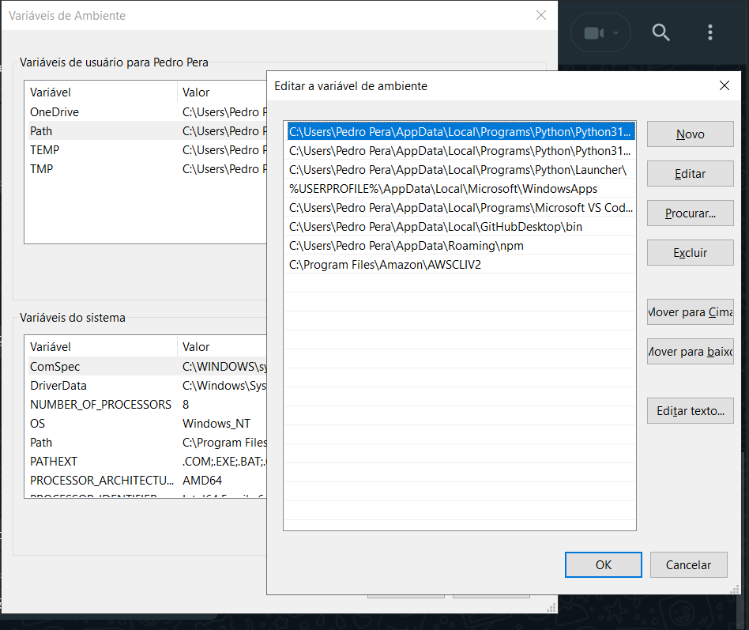
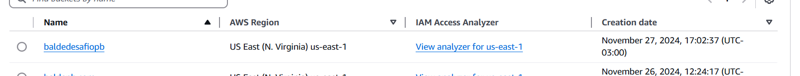
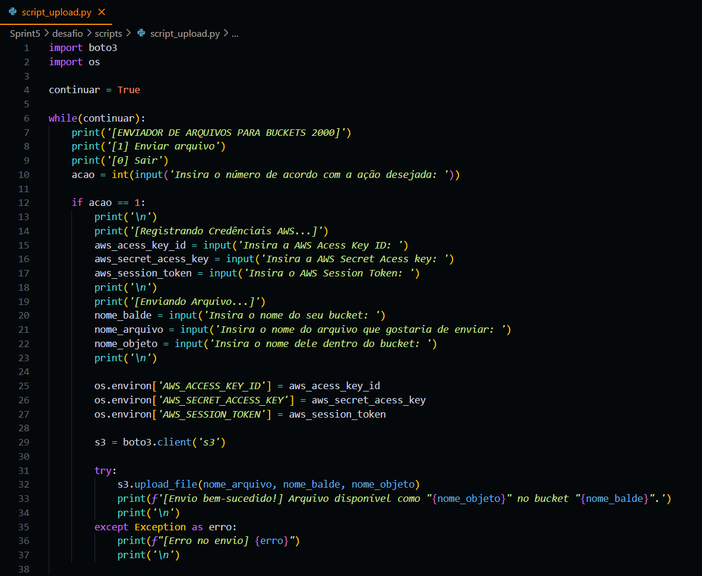
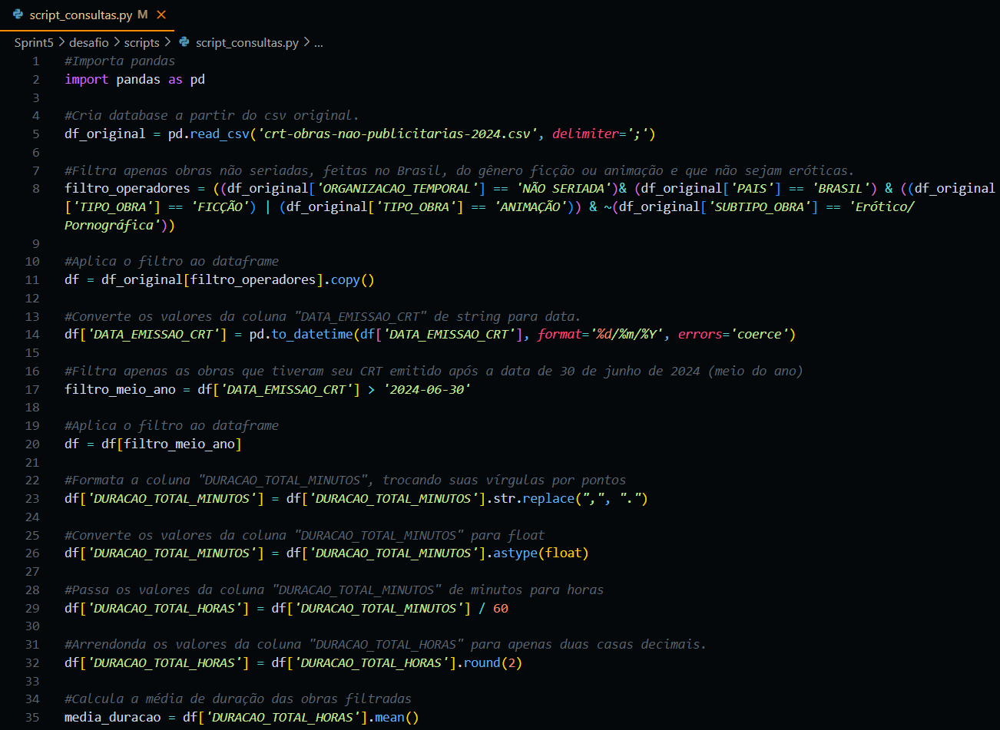
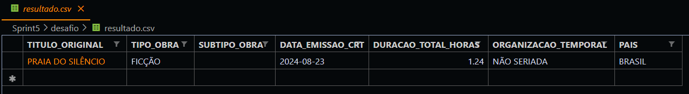
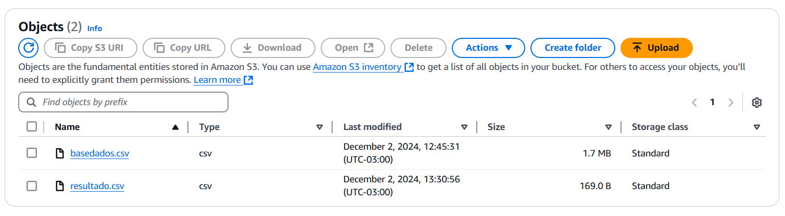

# SPRINT 5

## Exercícios
[Clique aqui](evidencias/exercicio) para ver todas as evidências da montagem e execução desse exercicio.

## Desafio
No desafio dessa sprint tivemos de criar um bucket no Amazon S3 que iria receber dois arquivos .csv por um script python com a biblioteca boto 3. Uma base de dados retirada do portal de dados abertos do governo e um arquivo .csv resultante de uma série de manipulações feitas na base de dados a partir de script em python em conjunto com pandas.

[Clique aqui!](desafio) Para ver todos os resultados e também o documento que descreve toda a jornada de como eles foram atingidos.

## Evidências
[Clique aqui](evidencias) para ver todas as evidências da montagem e execução desse desafio.

### Base de dados usada no desafio

### Instalando biblioteca boto3

### Instalando AWS CLI

### Configurando path para o CLI

### Criando balde no Amazon S3

### Script python com boto3 usado para enviar os arquivos para o bucket

### Script de manipulação em python com pandas

### Resultado do script

### Resultado final do bucket

## Certificados

- [Badge de conclusão do AWS CloudQuest)](certificados/AWS_CloudQuest-Badge.png)
- [Certificado de conclusão do curso de preparação para o exame AWS Certificate Cloud Pratictioner)](certificados/Curso_padrao_de_preparacao_para_exame_AWS_Certificate_Cloud_Pratictioner_-_Certificate.pdf)

