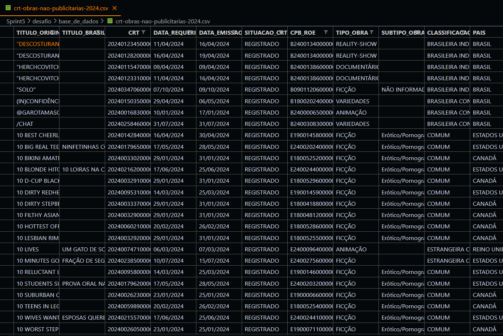
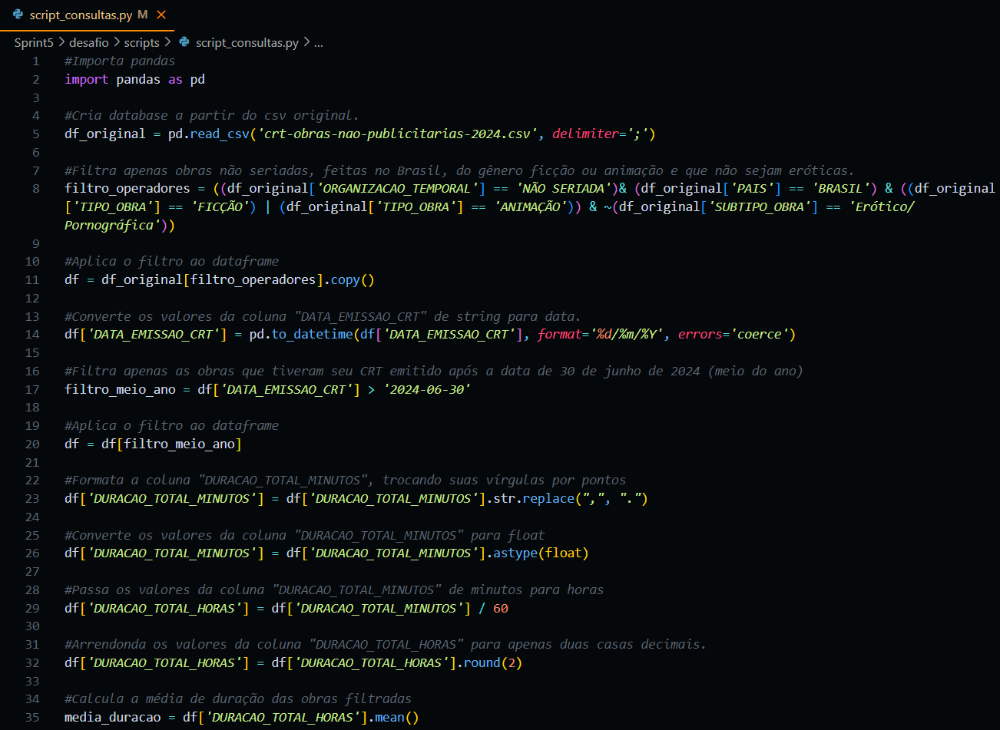
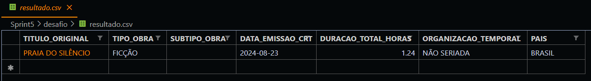

# Desafio da Sprint 5
Na nossa sprint 5, tivemos de escolher uma base de **dados do portal** de dados abertos do governo, criar um **bucket do Amazon S3** e um **script python** com a **biblioteca boto3** para **enviar a base de dados para esse bucket**. Com a base de dados no bucket, tivemos de localmente **realizar uma série de manipulações utilizando a biblioteca pandas** do python, gerando assim um resultado final que também deveria ser enviado para o bucket.

## Preparando o Espaço
A primeira coisa que fiz foi procurar pela base de dados no portal de dados abertos do governo. Escolhi e baixei uma base de dados que mostrava o **Certificado de Registro de Título (CRT) e outras informações sobre obras não-publicitárias**. Essa base de dados pode ser encontrada [aqui](https://dados.gov.br/dados/conjuntos-dados/crt-obras-nao-publicitarias-registradas).



Depois disso, **instalei a biblioteca boto3 e a ferramenta Amazon CLI**, depois **configurei o path do Windows** para que o CLI funcionasse corretamente.

### Instalando biblioteca boto3


### Instalando AWS CLI


### Configurando path para o CLI


## Etapa 1 
Com a base de dados em mãos e as ferramentas instaladas e configuradas, parti para a primeira etapa, que consistia em **criar um bucket do Amazon S3**, que é um serviço de armazenamento simples da AWS.


## Etapa 2
Após estar com o bucket devidamente criado, parti para a **criação do script para enviar a base de dados** utilizando **python e boto3**. 

O script primeiro dá a opção ao **usuário de enviar um arquivo ou sair do script**. Entrando na área de envio, o **script pede as credências da AWS** e depois as **informações necessárias para enviar o arquivo para o bucket**. Ao final, ele tenta enviar, caso consiga, é retornada uma mensagem de sucesso, caso não, uma mensagem de erro é impressa.


Com o script realizado, utilizei ele para enviar a base de dados.

## Etapa 3

Na etapa 3, era necessário criar um **script python usando o pandas para manipular a base de dados localmente**. O desafio nos pedia que fizéssemos manipulações específicas, que eram:

1. **Uma cláusula que filtra dados usando pelo menos dois operadores lógicos.**
2. **Duas funções de Agregação.**
3. **Uma função Condicional.**
4. **Uma função de Conversão.**
5. **Uma função de Data**
6. **Uma função de String.**

Sobre o script ele faz as seguintes manipulações:
- Filtra apenas **obras não seriadas**, **feitas no Brasil**, do **gênero ficção ou animação** e que **não fossem eróticas**.
- Converte os valores da coluna ```DATA_EMISSAO_CRT``` de **string para data**.
- Filtra apenas as obras que tiveram seu **CRT emitido após a data de 30 de junho de 2024** (meio do ano).
- Formata a coluna ```DURACAO_TOTAL_MINUTOS```, **trocando suas vírgulas por pontos**.
- Converte os valores da coluna ```DURACAO_TOTAL_MINUTOS``` **para float**.
- Passa os valores da coluna ```DURACAO_TOTAL_MINUTOS``` de **minutos para horas**.
- **Arrendonda** os valores da coluna ```DURACAO_TOTAL_HORAS``` para **apenas duas casas decimais**.
- Calcula a **média de duração das obras filtradas**.
- Filtra apenas as **obras que estão abaixo da média**.
- **Calcula qual o maior valor da coluna** ```DURACAO_TOTAL_HORAS```.
- Mostra colunas específicas da linha que possui o maior valor da coluna ```DURACAO_TOTAL_HORAS```.
- Transforma a linha que possui o maior valor da coluna ```DURACAO_TOTAL_HORAS``` em um arquivo ```.csv```.



O resultado obtido foi esse:

### Resultado


## Etapa 4
Com o script criado e o resultado em ```.csv``` ter sido criado, eu utilizei o mesmo script anterior para enviar o arquivo de resultado para o bucket.


## Conclusão
O exercício foi bem desafiador em relação à conexão com a AWS a partir do boto3 e o Amazon CLI, já que tivemos de pesquisar tudo por conta própria e foi bem complicado para podermos conectar tudo corretamente. Tirando essa parte, o resto do desafio foi bem tranquilo, já que usamos uma biblioteca e uma linguagem já conhecida.

