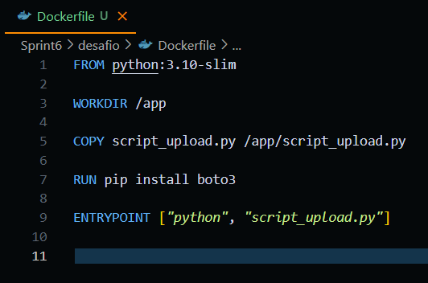
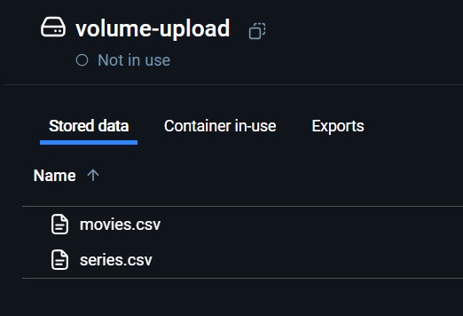

# SPRINT 6

## Exercícios
[Clique aqui](evidencias/exercicio) para ver todas as evidências da montagem e execução desse exercicio.

## Desafio
No desafio desta sprint, foi necessário desenvolver um script em Python utilizando a biblioteca boto3, que possibilitasse a criação de um bucket no Amazon S3 e o envio de dois arquivos .csv para ele. O script precisava ser executado em um container Docker, e os arquivos deveriam ser obtidos a partir de um volume Docker.

[Clique aqui!](desafio) Para ver todos os resultados e também o documento que descreve toda a jornada de como eles foram atingidos.

## Evidências
[Clique aqui](evidencias) para ver todas as evidências da montagem e execução desse desafio.

### Script de envio de arquivos e criação de buckets

### Dockerfile

### Construindo imagem

### Criando volume

### Rodando volume em um container temporário

### Copiando arquivos para o volume

### Volume no dockerdesktop

### Criando bucket

### Bucket no console da Amazon

### Enviando arquivos .csv

#### Enviando movies.csv

#### Enviando series.csv

## Certificados

[Enviando series.csv](certificados/AWS_Glue_Getting_Started.pdf)
