# Desafio da Sprint 6
Nesta Sprint 6, tivemos que criar um **script em Python** que, em conjunto com a **biblioteca boto3**, nos permitisse criar um **bucket no Amazon S3** e enviar dois **arquivos .csv para esse bucket**. Esse **script deveria ser executado dentro de um container Docker**, e os **arquivos deveriam ser puxados de um volume Docker**.

## Preparando o espaço
A primeira tarefa foi garantir que os arquivos estivessem em mãos, pois precisaríamos analisá-los para gerar questões que iríamos tratar futuramente nas próximas sprints.

### Questões pensadas...

1. Quais são os cinco atores mais presentes em filmes de drama e como sua participação influenciou as notas dos filmes em que protagonizaram?
2. Qual é a tendência de gênero dos atores escolhidos para protagonizar filmes de drama?
3. Quais características os cinco filmes de drama mais votados e mais bem avaliados têm em comum?
4. Qual década tem os filmes de drama mais bem avaliados e quais são os possíveis motivos?

## Etapa 1
A primeira etapa consistiu na criação do script. Para a parte de envio, utilizei o mesmo script da sprint passada e **adicionei uma nova opção para a criação de buckets**, que é bem semelhante ao processo de envio de arquivos.

Ao **selecionar a opção de criar um novo bucket S3** no menu, o script **solicita as credenciais da AWS**, o **nome e a região do novo bucket**. Ao final, ele tenta criar o bucket e, caso tenha sucesso, exibe uma mensagem de confirmação, caso contrário, imprime uma mensagem de erro.

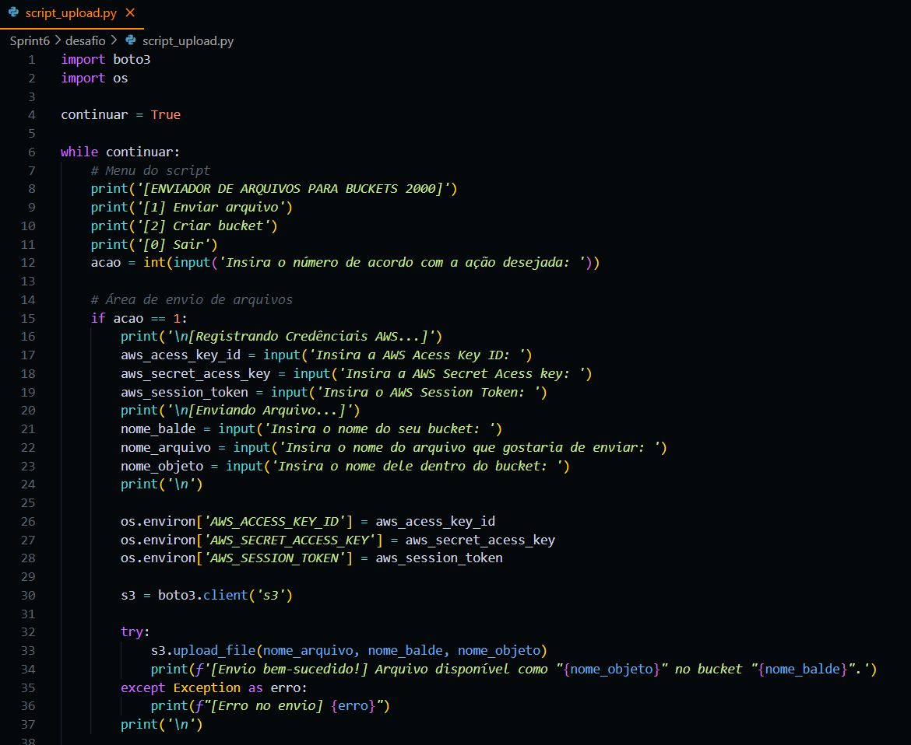

Com a certeza de que o script estava funcionando devidamente na minha máquina, passei para a criação da imagem, volume e container.

## Etapa 2
Iniciei essa etapa **criando o Dockerfile** para **gerar a minha imagem**.

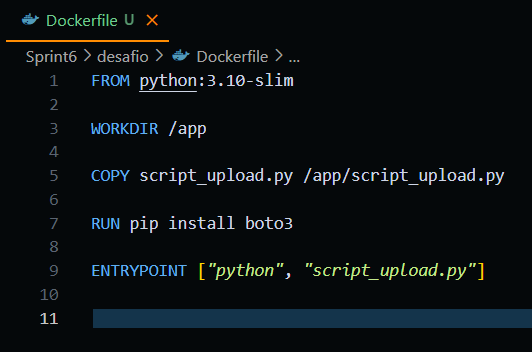

Sua construção é bem simples: basicamente, ele utiliza a **imagem ```python:3.10-slim``` como base**, **copia o script para dentro do container**, **instala a biblioteca boto3** para o correto funcionamento do script e, por fim, **insere os comandos necessários para executar o script junto com o container**.

### Construindo imagem
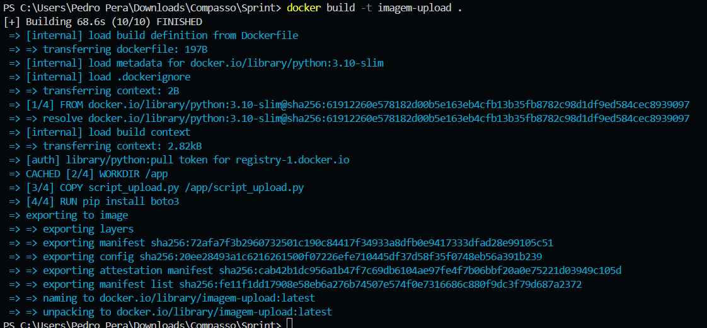

Na criação do volume, **após ele ser gerado**, foi necessário **rodar um container temporário para copiar os arquivos para dentro do volume**.

### Criando volume
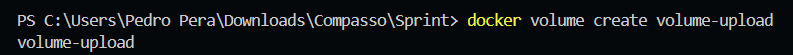

### Rodando volume em um container temporário
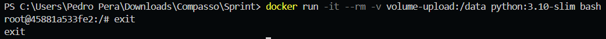

### Copiando arquivos para o volume
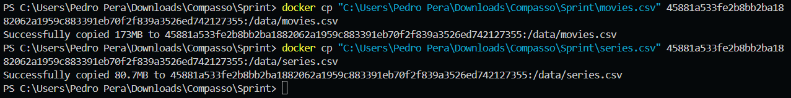

### Volume no dockerdesktop
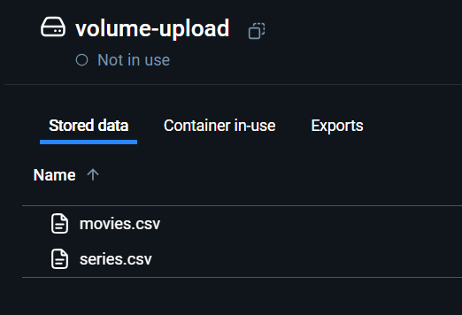

## Etapa 3
Tendo a imagem e o volume prontos, **executei o container com o script**, **criei o bucket ```datalake-pedrovilela``` e enviei os dois arquivos .csv.**

### Criando bucket
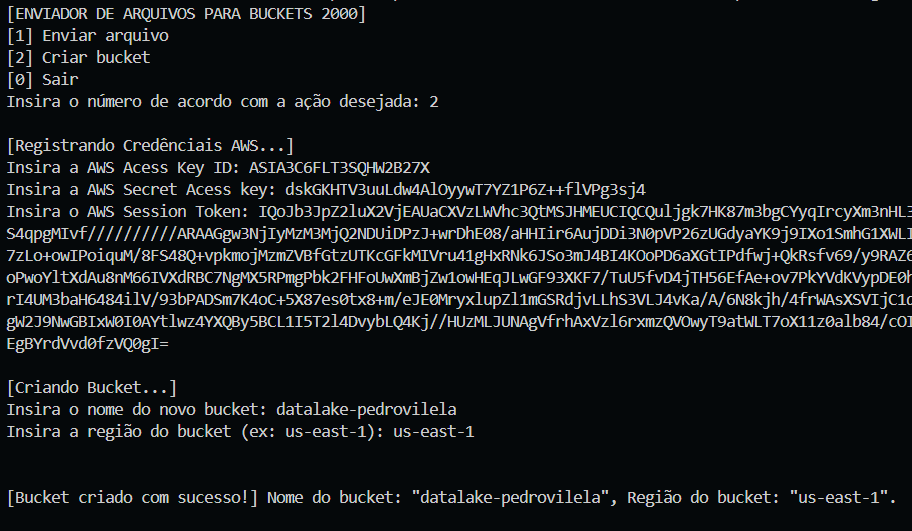

### Bucket no console da Amazon
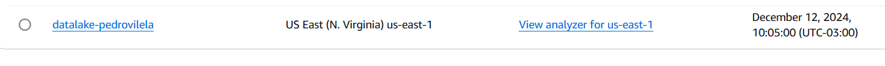

### Enviando arquivos .csv

#### Enviando movies.csv
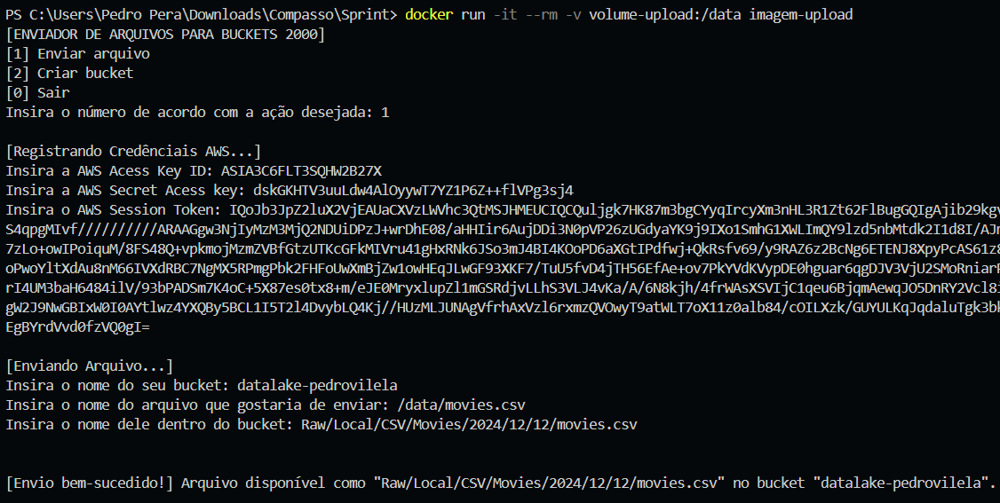
#### Enviando series.csv
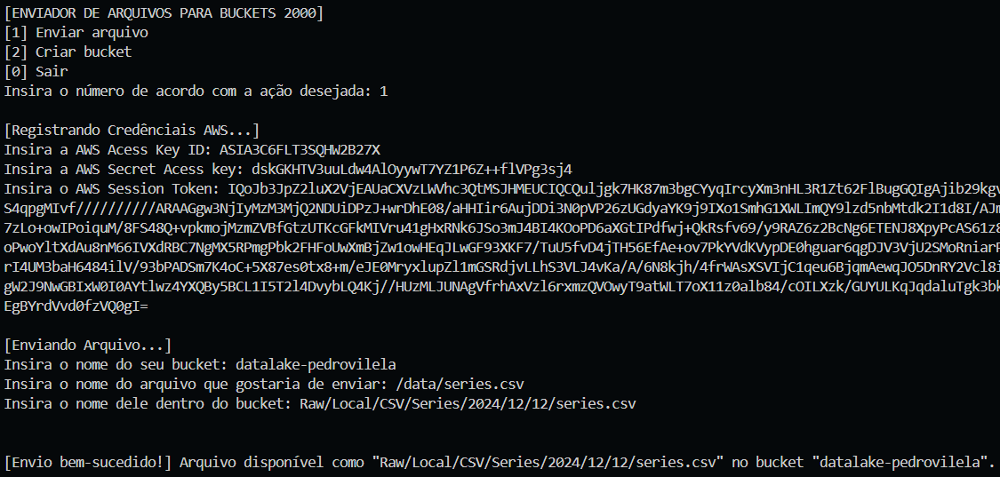

### Arquivos .csv no console da amazon

#### Enviando movies.csv
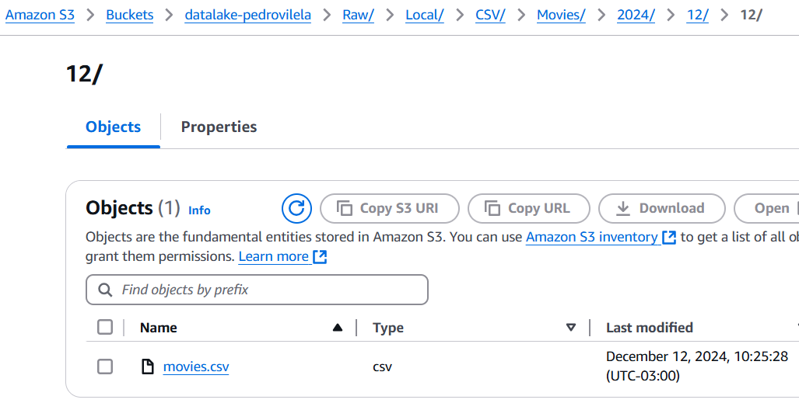
#### Enviando series.csv
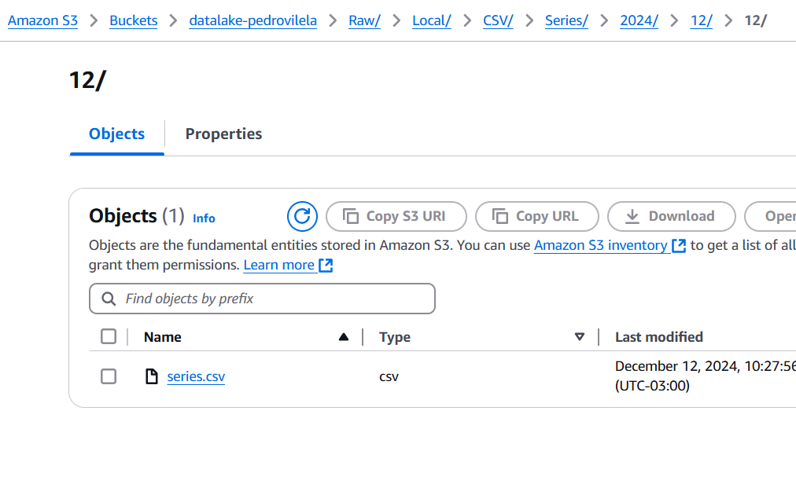

