# Desafio da Sprint 7
Na sprint 7 tivemos de **construir um script em python** que **permitisse buscar informações da API desejada**, que no meu caso foi o **TMDB**, para **acrescentar dados as nossas análises futuras**. Esses **dados buscados deveriam depois ser passados para JSON** e **enviados para o bucket que criamos na sprint passada**.

## Mudança nas questões
Nessa sprint, **optei por mudar o alvo das minhas análises**, a partir de agora estarei analisando os **filmes mais populares e o que causou tal popularidade**. 

## Preparando o espaço
Antes de criar o script precisei de duas coisas, a **função Lambda** e a **camada com as bibliotecas necessárias** para rodar o nosso script, que no caso era o **pandas e o request**.

A criação da função foi bem simples, pois já tinha tido contato com ela na última sprint, mas um ponto importante a se citar é o de que tive de alterar a política da função para que ela pudesse inserir objetos no bucket.

### Criando a função lambda.
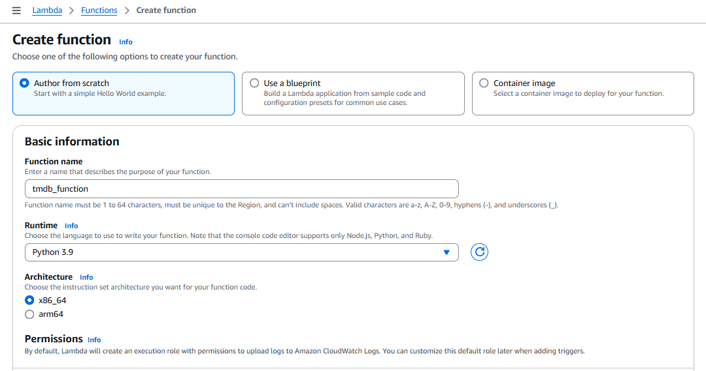

### Adicionando política de escrita a função lambda.
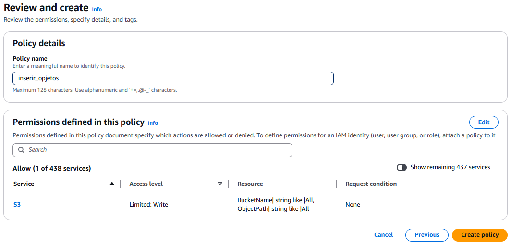

Para criar a camada foi necessário primeiro **fazer uma dockerfile**, que usou da imagem **amazonlinux 2023 como base e instala o python 3**.

### Dockerfile usada para criar a camada.
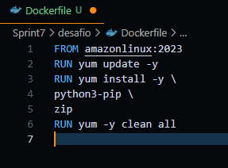

Após **construir uma imagem com base na dockerfile**, **rodei essa imagem em um contêiner descartável e interativo**. Assim podemos digitar os comandos no bash para **criar a estrutura de pastas com as bibliotecas**, **compactar em um arquivo zip ao final** e o container vai ser excluído assim que acabar de ser executado. 

### Construindo imagem.
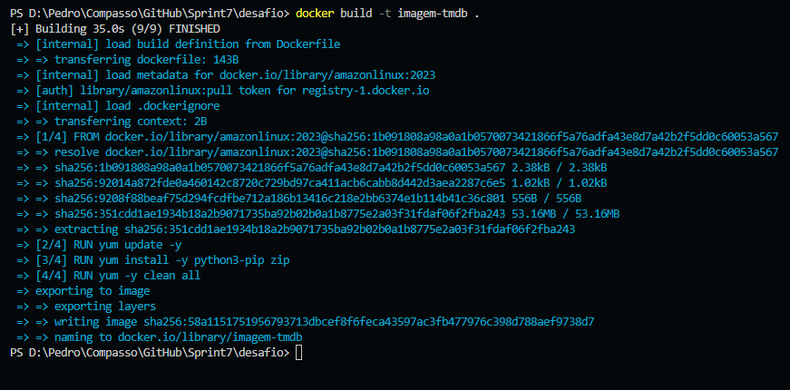

### Criando camada no bash.
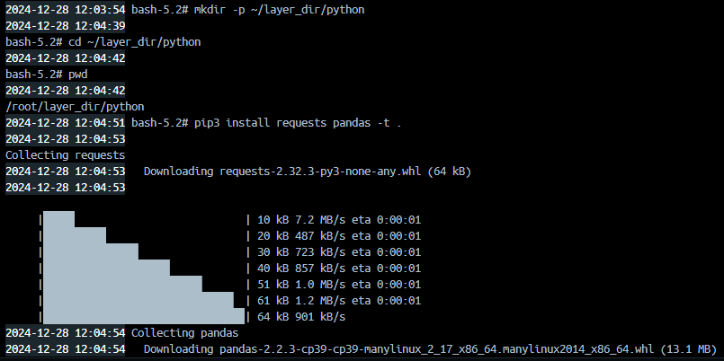

Com o arquivo compactado, em outro terminal, **busquei o id do container que estava executando** e **copiei a nossa camada zipada para a minha máquina e a coloquei na função Lambda que eu havia criado**.

### Copiando arquivo compactado da camada para minha máquina local.
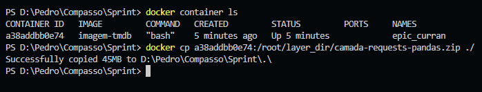

### Criando camada.
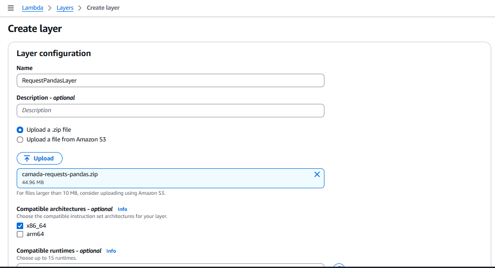

### Adicionando a camada na minha função Lambda

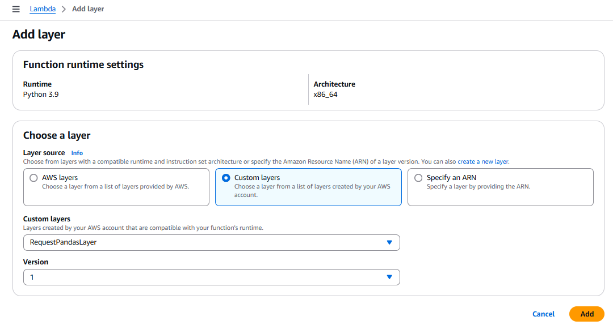

## Etapa 1
A primeira e única etapa foi a de **construção do script**, que funciona da seguinte maneira:

Ele procura, em **ordem decrescente de popularidade na API do TMBD**, todos os **filmes que tenham o id de gênero igual a drama ou romance** e **tenham sido lançados antes da data do 31 de dezembro de 2022**. Essa data corresponde ao último registro do csv que enviamos na sprint 6. E ele continuará a procurar **até que a lista contenha 10 filmes mais populares de cada gênero**.

Após as duas listas de filmes estarem cheias, **ele as transforma em dataframes e as envia para o bucket ```dataframe-pedrovilela```**.

### Script criado.
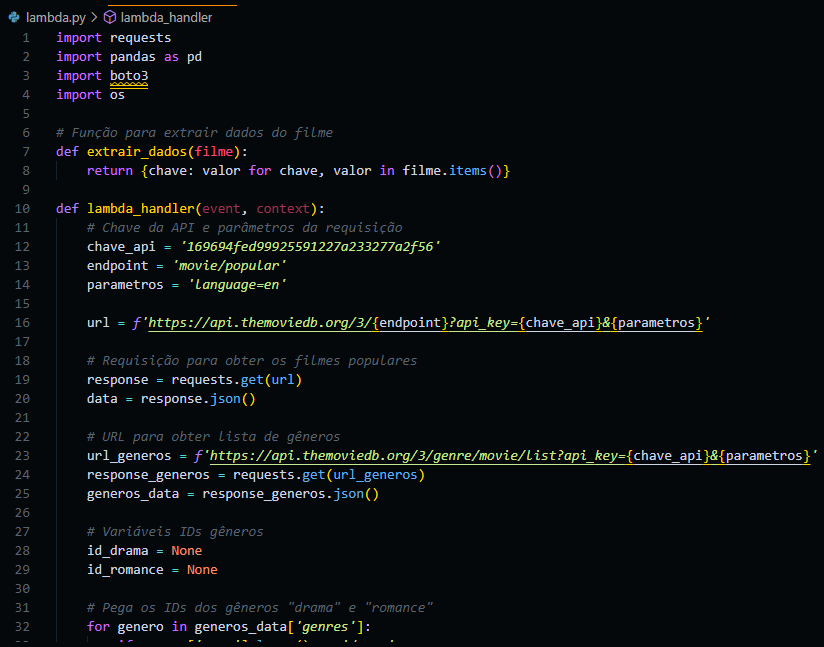

### Resultado no console do lambda.
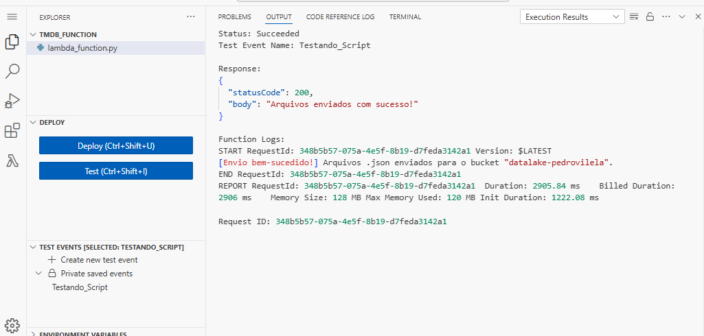

### Resultado.
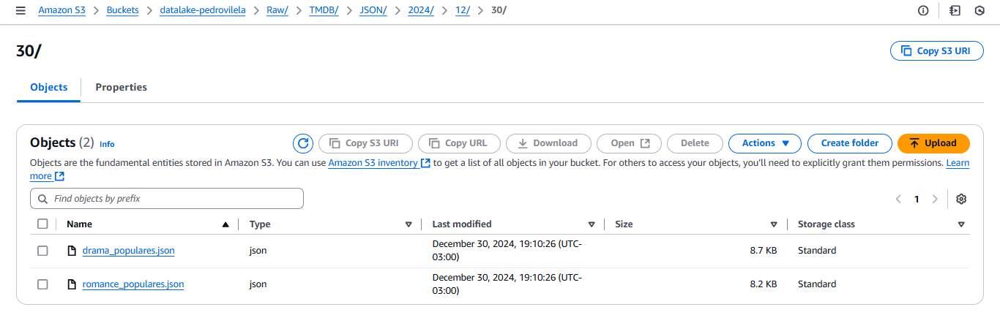

## Conclusão
Esse desafio, na íntegra, não era complicado, porém, fazer com que a API retornasse exatamente o que eu precisava foi um pouco difícil, mas nada que algumas pesquisas não resolvessem. Além disso, acabei passando um bom tempo pensando em como seguiria minhas análises, mas consegui chegar em um ponto onde acredito que conseguirei desenvolver boas análises.

