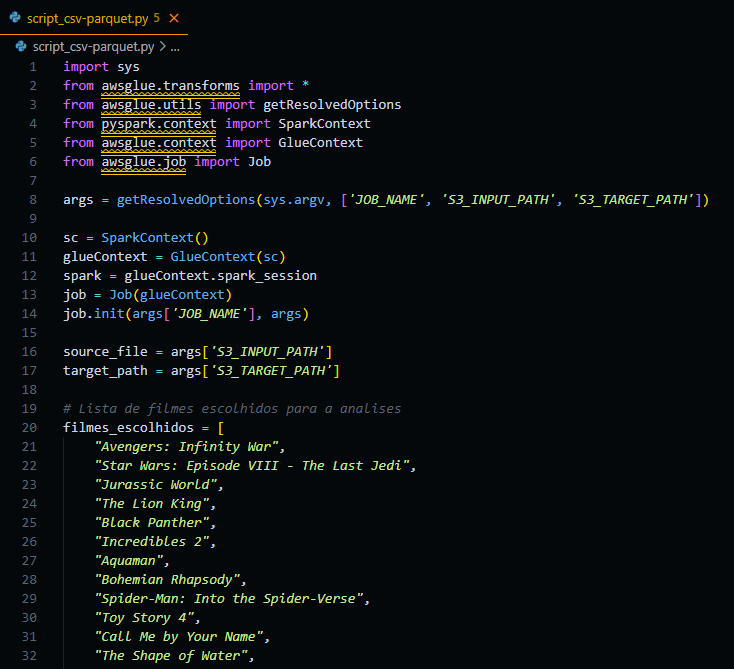
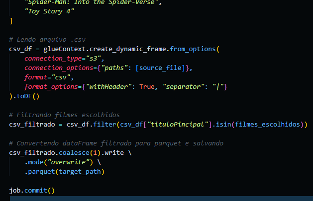
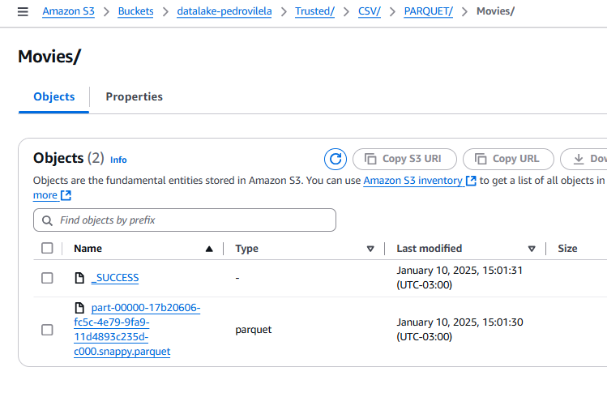
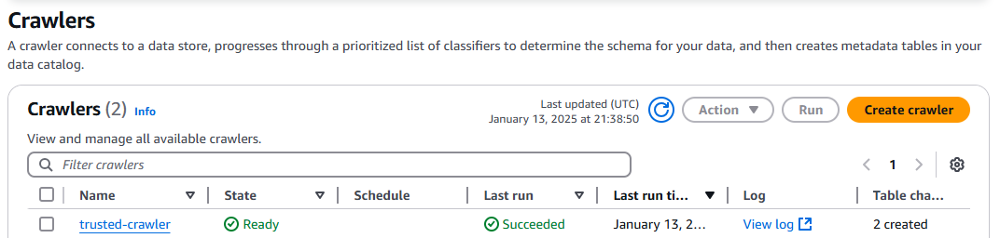
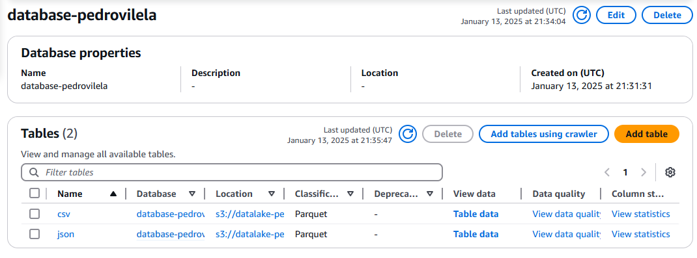

# SPRINT 8

## Exercícios

- [Exercício de Geração e Massa de Dados](exercicios/geracao_e_massa_de_dados)
- [Exercício com Spark](exercicios/apache_spark)
- [Exercício com TMDB](exercicios/tmdb)

[Clique aqui](evidencias/exercicios) para ver todas as evidências da montagem e execução desse exercicio.

## Desafio
Nesta sprint 8, fomos responsáveis por criar dois jobs no AWS Glue para transformar as bases de dados enviadas nas sprints anteriores. O objetivo era converter os dados de seus formatos originais para o formato Parquet, utilizando Python em conjunto com Spark. Assim, configuramos um job para processar os arquivos CSV e outro para os arquivos JSON. Por fim, criamos um crawler para catalogar os dados transformados.

[Clique aqui!](desafio) Para ver todos os resultados e também o documento que descreve toda a jornada de como eles foram atingidos.

## Evidências

### Criando Job


### Alterando Worker Type e Number of Workers


### Alterando Job Timeout


### Parâmetros do job


### Script para transformar CSV para Parquet - Parte 1


### Script para transformar CSV para Parquet - Parte 2


### Resultado Final


### Script para transformar JSON para Parquet - Parte 1


### Script para transformar JSON para Parquet - Parte 2


### Resultado Final


### Crawler ```trusted-crawler``` no Glue


### Execução do Crawler


### Tabelas criadas pelo Crawler


## Certificados
#### Não tivemos certificados para essa Sprint.
