# Desafio da Sprint 8
Nessa sprint tivemos de realizar dois jobs dentro do AWS Glue para transformar as bases de dados que enviamos nas últimas sprints, de seus formatos originais para o formato parquet por meio do Python em conjunto com o Spark. Então teríamos um job para o CSV e outro para os JSONs e ao final criamos um crawler para catalogar os dados que transformamos.

# Alteração da análise
Após pensar mais um pouco, maturei minha ideia e decidi trazer uma análise de como a pandemia da COVID-19 influenciou na indústria dos filmes de drama/romance.

# Etapa 1
A primeira coisa a ser feita eram os dois jobs. Ambos realizariam a transformação do arquivo do seu formato original para o formato parquet, pois ele é mais fácil de ser processado. Após criá-los no Glue, foi necessário realizar algumas alterações que o desafio pedia, como: 
- Worker Type: G 1x
- Number of Workers: 2
- Job Timeout: 60

## Alterações dos jobs

### Alterando Worker Type e Number of Workers
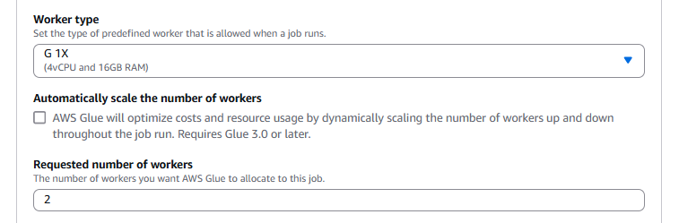

### Alterando Job Timeout
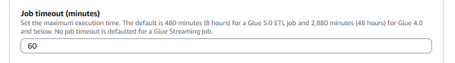

Além dessas, tive de aplicar uma política IAM para que os dois jobs pudessem inserir objetos no Amazon S3 e adicionar os parâmetros do Job de caminho da fonte (Input Path) e caminho de destino (Target Path).

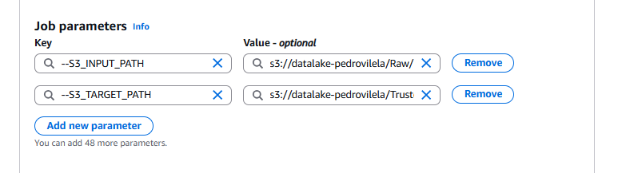

Com tudo isso devidamente configurado, eu parti para os scripts.

## CSV para Parquet
O script que transforma o CSV para parquet funciona da seguinte maneira: 

Ele primeiro importa as bibliotecas e os parâmetros necessários para o funcionamento do job, depois configura o ambiente Glue e armazena os caminhos de fonte e de salvamento dos arquivos novos.
Após isso, eu criei uma lista com os nomes de quais filmes eu iria analisar, que serviria como filtro para enviar apenas aquilo que eu vou utilizar para não desperdiçar espaço de memória. Por fim, ele salva o arquivo no caminho específico em formato Parquet.

### Script para transformar CSV para Parquet - Parte 1
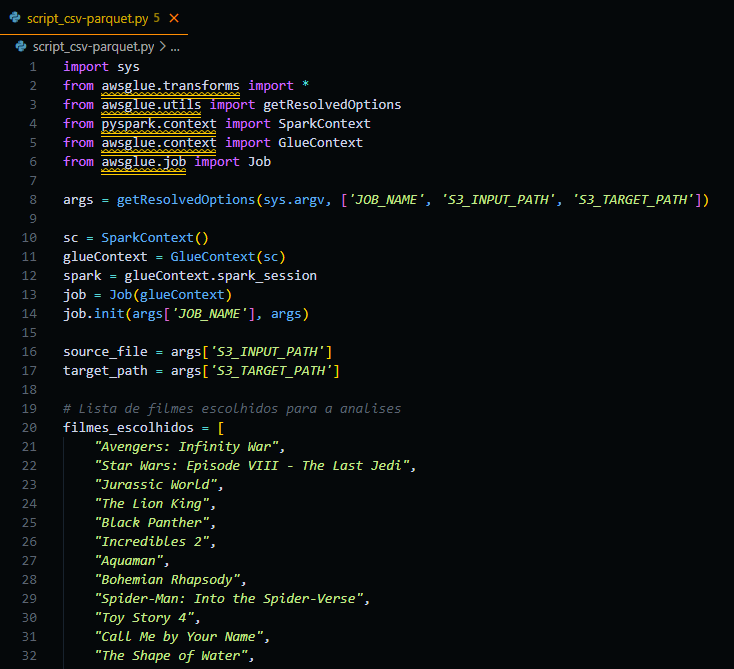

### Script para transformar CSV para Parquet - Parte 2
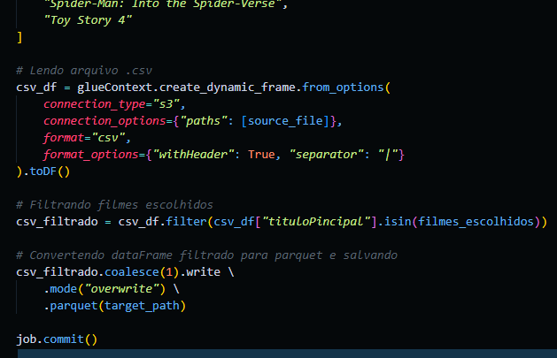

### Resultado Final
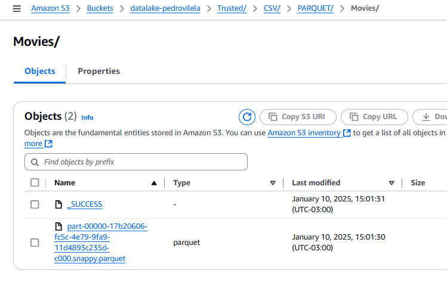

## JSON para Parquet
O script que transforma os arquivos JSON para Parquet funciona de forma semelhante:

Assim como o script para o CSV, ele também possui toda a configuração necessária para que o job funcione corretamente.
Depois disso, ele possui armazenado o nome de cada um dos arquivos JSON na pasta original. Isso foi feito para que eu possa transformar todos os arquivos em uma única execução, pois o script roda em uma estrutura de repetição que junta o caminho até a pasta com o arquivo específico, lê o arquivo o transformando em dataframe, e ao final transforma esse dataframe em um arquivo parquet e o salva no caminho especificado na hierarquia que o desafio pedia: ```origem do dado\formato do dado\especificação do dado\data separada por ano\mês\dia\arquivo```

### Script para transformar JSON para Parquet - Parte 1
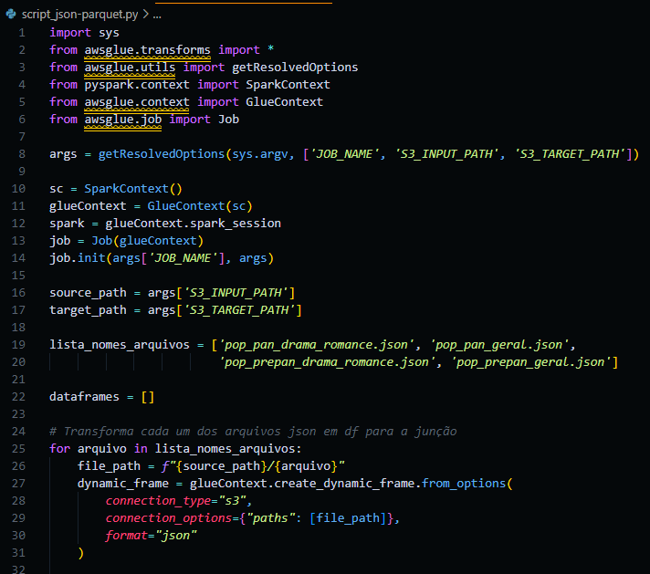

### Script para transformar JSON para Parquet - Parte 2
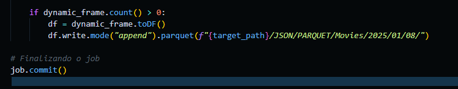

### Resultado Final
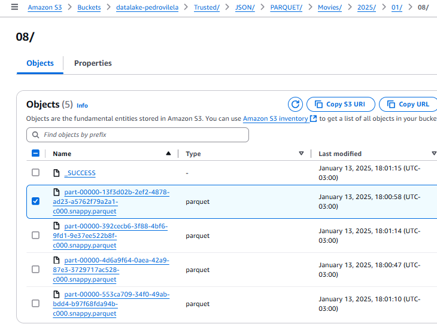

# Etapa 2
A última etapa consistia em criar o crawler para catalogar os nossos dados, que após criado, com o nome de ```trusted-crawler```, e executado, nos entregou as duas tabelas com os dados catalogados para usarmos com o AWS Athena.

### Crawler ```trusted-crawler``` no Glue
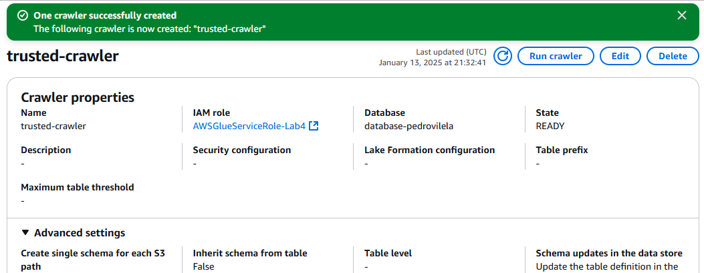

### Execução do Crawler
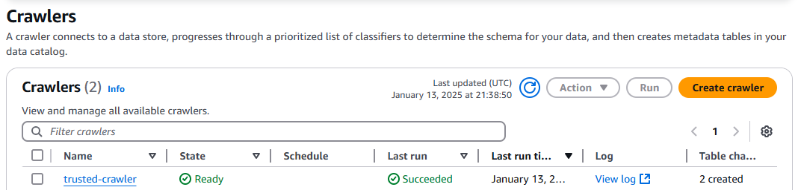

### Tabelas criadas pelo Crawler
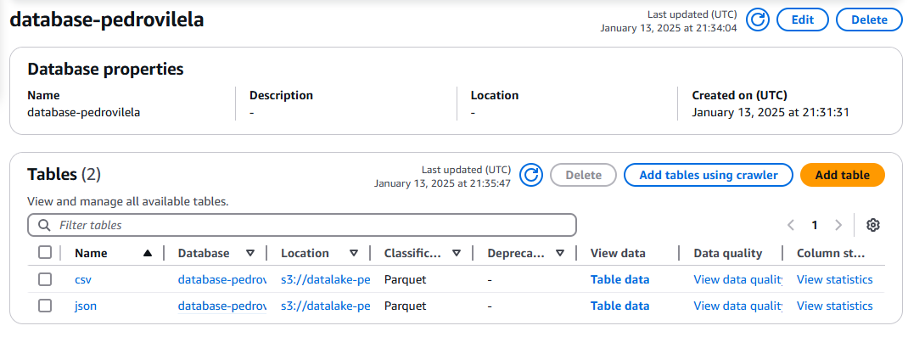

# Conclusão
O desafio em si não era tão complexo de ser desenvolvido, porém, acredito que o enunciado com as instruções não estava tão claro em relação ao das últimas sprints, por isso eu tive de tomar algum tempo para perguntar aos colegas e ao monitor para poder compreender corretamente o que era para ser feito. Apesar desse pequeno problema, acredito ter executado tudo o que foi pedido com êxito.
