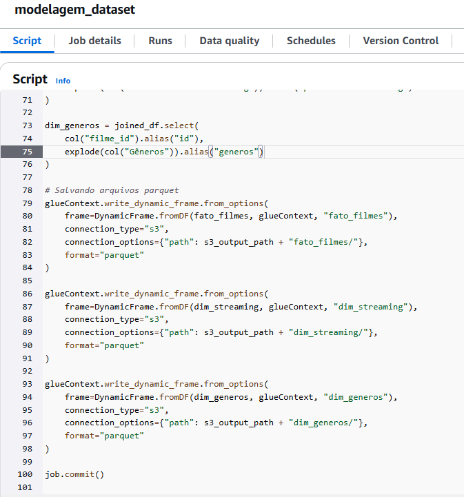

# SPRINT 9

## Exercícios
#### Não tivemos exercícios nessa sprint.

## Desafio
Na sprint 9, tivemos que desenvolver uma modelagem dimensional e criar um job para ler os arquivos parquet da camada trusted, selecionando as colunas necessárias para montar a tabela fato e suas dimensões. Por fim, realizamos um crawler para catalogar os dados e gerar as tabelas que serão usadas para consultas na próxima sprint.

[Clique aqui!](desafio) Para ver todos os resultados e também o documento que descreve toda a jornada de como eles foram atingidos.

## Evidências

### Modelo Dimensional

### Configurando Job

### Script

### Tabela Fato Filmes

### Dimensão Gêneros

### Dimensão Streaming

### Execução crawler

### Tabelas criadas pelo crawler

## Certificados
#### Não tivemos certificados para essa sprint.
