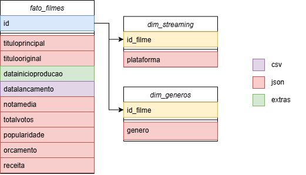
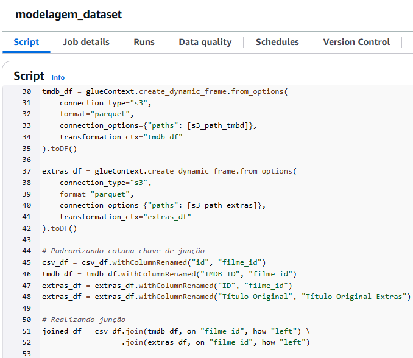
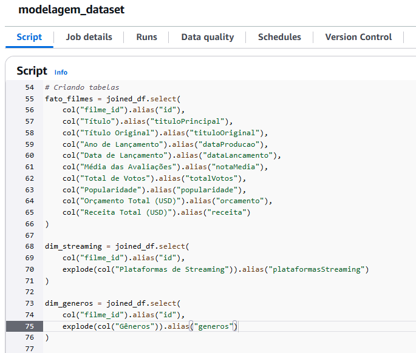
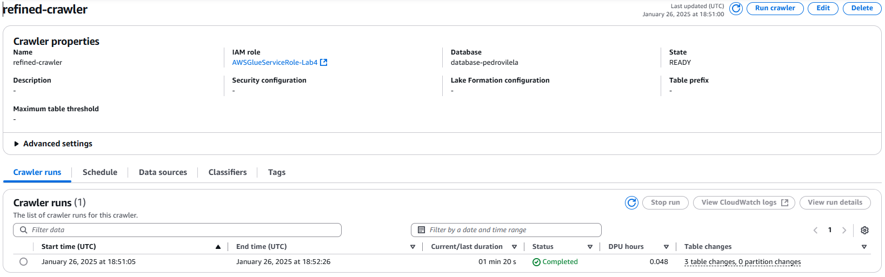

# Desafio da Sprint 9
Na sprint 9, nos foi requisitado que **criássemos uma modelagem dimensional**, **um job para ler os parquets da camada trusted**, **selecionar as colunas necessárias** para montar nossa tabela fato e as suas dimensões. Por fim, tivemos de **realizar um crawler para catalogar os dados** e gerar as tabelas que serão utilizadas na próxima sprint para as querys.

## Etapa 1
A primeira coisa a ser feita era a **modelagem dimensional**, para isso utilizei a ferramenta **[draw.io](https://app.diagrams.net/)**, uma ferramenta online para a criação de diagramas e fluxogramas. 
Conforme as perguntas da minha análise, fui estruturando o que eu gostaria que tivesse na tabela fato, e por uma questão de normalização, **coloquei os gêneros e as plataformas de streaming** onde aqueles filmes estão disponíveis em dimensões diferentes. Isso por conta de que um filme pode ter mais de um gênero, assim como pode estar associado a mais de um streaming.



## Etapa 2
Com a modelagem feita, comecei a fazer o **job no AWS Glue** que nomeei como ```modelagem-dataset```, mas antes realizei algumas configurações no job alterando os seguintes parâmetros:
- Worker Type: ```G 1x```
- Number of Workers: ```2```
- Job Timeout: ```60```


Estando o job devidamente configurado, passei para a criação do script que funciona da seguinte maneira:

1. Importa as bibliotecas e configura o ambiente do job.
2. Armazena os caminhos de cada uma das pastas onde se localizam os arquivos parquet e do caminho de destino, que deveria ser a nova camada trusted.
3. Lê cada um dos arquivos parquet e os tranforma em um dataframe.
4. Altera o nome das colunas que serviriam como chave de junção para um nome em comum (filme_id) e altera o nome de uma das colunas de título para retirar uma duplicidade.
5. Junta os dataframes.
6. Realiza os selects das colunas, as separando na tabela fato e suas dimensões.
7. Passa a tabela fato e dimensões para parquet e salva no caminho de destino.






Com o job executado, os resultados foram de acordo com o esperado.

### Tabela Fato Filmes

### Dimensão Gêneros

### Dimensão Streaming


## Etapa 3
Por fim, a última coisa a ser feita era **catalogar os dados e criar as tabelas com o crawler**.

Utilizei do mesmo crawler e database da sprint 8.

### Execução crawler


### Tabelas criadas pelo crawler


# Conclusão
Essa sprint em si não foi complexa, eu enfrentei dois principais problemas durante a minha jornada. O primeiro foi a falta de clareza das instruções do desafio, que tivemos de esperar o monitor consultar quais eram as atividades dessa sprint. O segundo problema, que foi minha base de dados, eu tive de modificá-la algumas boas vezes para que ela estivesse minimamente boa para realizar esse desafio e responder às minhas perguntas da análise. Felizmente, como já pontuado, o desafio foi bem simples e assim que esses empecilhos foram resolvidos, tudo fluiu com facilidade.

Uma observação importante que gostaria de fazer é que no desafio não havia nenhum indicativo de como deveria ser a organização de pastas da camada trusted, apenas conseguimos descobrir essa informação com certeza após conversar com o corretor das sprints.
