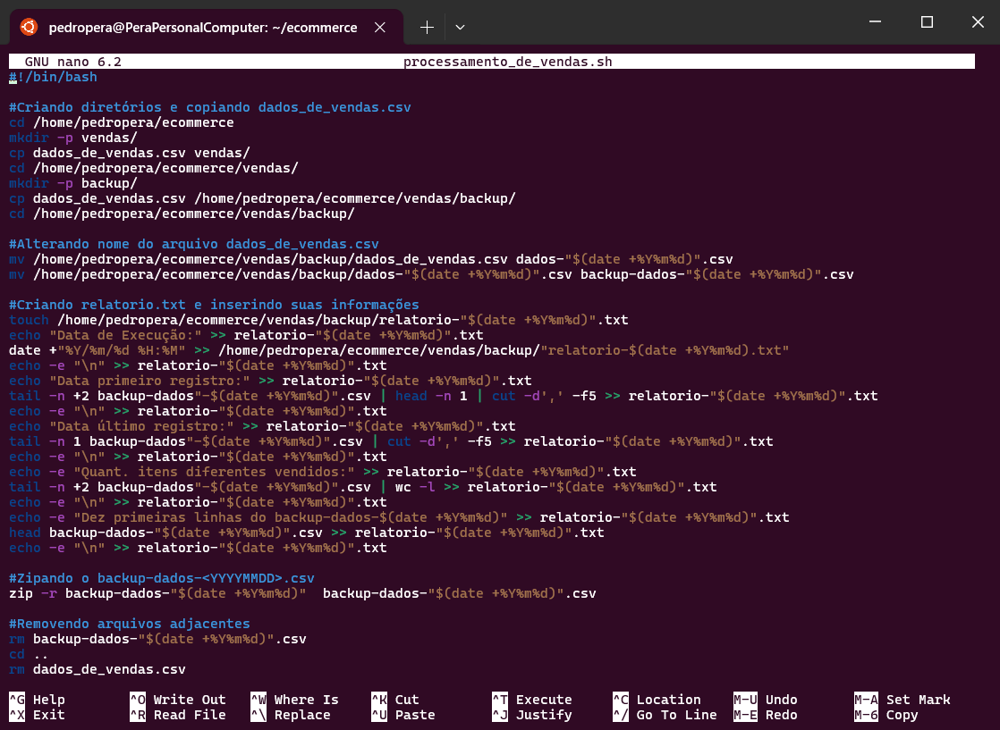
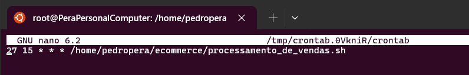
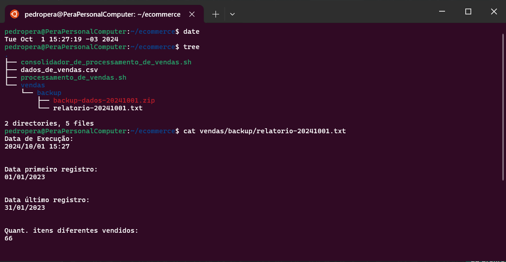

# SPRINT 1

## Exercícios
#### Não tivemos exercícios nessa Sprint.

## Desafio
O desafio dessa sprint consistiu em usar comandos do shell do Linux para realizar um script que processasse e gerasse relatórios automaticamente por 4 dias seguidos a partir de uma base de dados.

[Clique aqui!](./desafio) Para ver todos os resultados e também o documento que descreve toda a jornada de como eles foram atingidos.

## Evidências
[Clique aqui](./evidencias) para ver todas as evidências da montagem e execução desse desafio.

### Criando pasta mãe.
Após conseguir rodar uma distribuição Linux no meu computador realizei o primeiro passo que cosistiam em criar o diretório ```ecommerce```.

[](./evidencias)

### Script ```processamento_de_vendas.sh```.
Criei esse script que tem o trabalho de realizar a criação da estrutura de pastas e a geração dos relatórios baseados nas informações contidas na base de dados que passamos.

[](./evidencias)

### Agendando a execução do script.
No desafio era descrito que precisávamos agendar a execução para que rodasse por **quatro** dias às exatas **15h27**, para isso utilizei a ferramenta crontab por meio do usuário **root** ou **super-usuário** para que esse agendamento fosse corretamente realizado sem problemas com permissões.



### Executando Script.
Com a tarefa devidamente agendada, aguardei o momento da execução por todos os quatro dias, por volta de 15h25, para assim ter a certeza de que tudo seria devidamente realizado. Abaixo temos a primeira execução do script feita com sucesso! [Clique aqui](./desafio/README.md) para ver todas as execuções.

[](./evidencias)

### Script ```consolidador_de_processamento_de_vendas.sh```.
Após ter todos os quatro relatórios em mãos, o desafio nos pede que os juntemos em um único arquivo ```relatorio_final.txt``` através de um script chamado ```consolidador_de_processamento_de_vendas.sh``` que está na imagem abaixo.

[](./evidencias)

## Certificados
#### Não tivemos certificados para essa Sprint.
