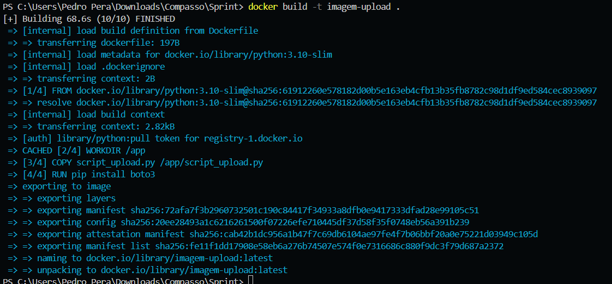
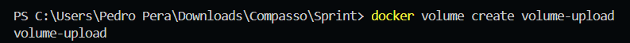
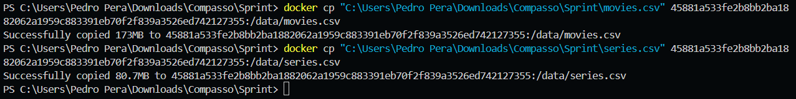

# SPRINT 6

## Exercícios
[Clique aqui](evidencias/exercicios) para ver todas as evidências da montagem e execução desse exercicio.

## Desafio
No desafio desta sprint, foi necessário desenvolver um script em Python utilizando a biblioteca boto3, que possibilitasse a criação de um bucket no Amazon S3 e o envio de dois arquivos .csv para ele. O script precisava ser executado em um container Docker, e os arquivos deveriam ser obtidos a partir de um volume Docker.

[Clique aqui!](desafio) Para ver todos os resultados e também o documento que descreve toda a jornada de como eles foram atingidos.

## Evidências
[Clique aqui](evidencias) para ver todas as evidências da montagem e execução desse desafio.

### Script de envio de arquivos e criação de buckets

### Dockerfile

### Construindo imagem

### Criando volume

### Rodando volume em um container temporário

### Copiando arquivos para o volume

### Volume no dockerdesktop

### Criando bucket

### Bucket no console da Amazon

### Enviando arquivos .csv

#### Enviando movies.csv

#### Enviando series.csv

## Certificados

- [AWS Glue Getting Started](certificados/AWS_Glue_Getting_Started.pdf)
- [Amazon EMR Getting Started](certificados/Amazon_EMR_Getting_Started.pdf)
- [AWS Glue Getting Started](certificados/Amazon_QuickSight_-_Getting_Started.pdf)
- [Amazon QuickSight - Getting Started](certificados/Best_Practices_for_Data_Warehousing_with_Amazon_Redshift_(Portuguese).pdf)
- [Fundamentals of Analytics on AWS – Part 1 (Portuguese)](certificados/Fundamentals_of_Analytics_on_AWS_–_Part_1_(Portuguese).pdf)
- [Fundamentals of Analytics on AWS – Part 2 (Portuguese)](certificados/Fundamentals_of_Analytics_on_AWS_–_Part_2_(Portuguese).pdf)
- [Getting Started with Amazon Redshift (Portuguese)](certificados/Getting_Started_with_Amazon_Redshift_(Portuguese).pdf)
- [Introduction to Amazon Athena (Portuguese)](certificados/Introduction_to_Amazon_Athena_(Portuguese).pdf)
- [Serverless Analytics (Portuguese)](certificados/Serverless_Analytics_(Portuguese).pdf)

