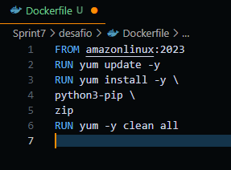
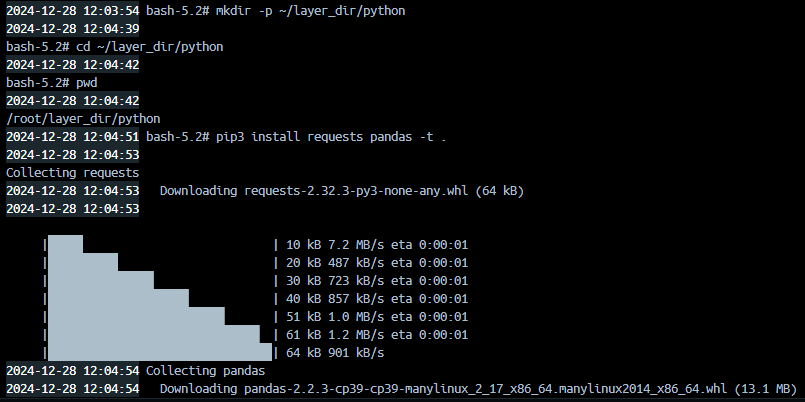
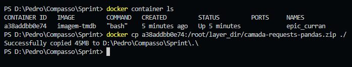
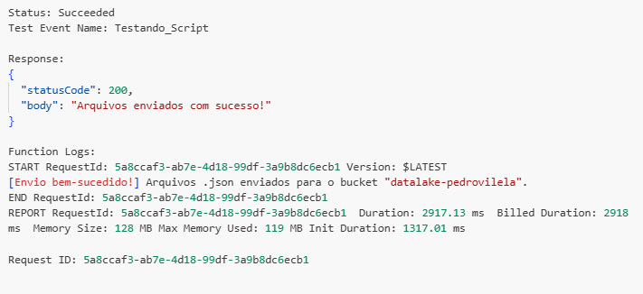
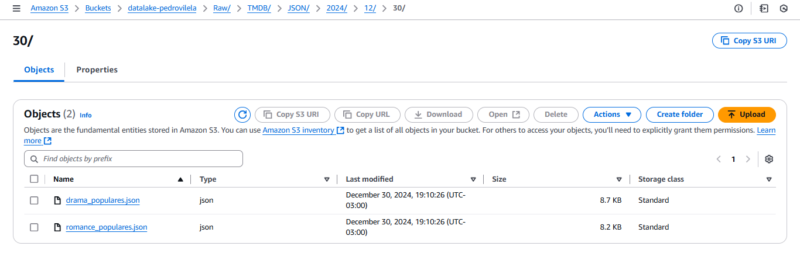

# SPRINT 7

## Exercícios

- [Exercício com Spark](exercicios/ApacheSpark)
- [Exercício com TMDB](exercicios/TMDB)
- [Exercício com AWS Glue](exercicios/Glue)

[Clique aqui](evidencias/exercicios) para ver todas as evidências da montagem e execução desse exercicio.

## Desafio
Na sprint 7, tivemos que criar um script em Python para buscar dados da API TMDB que serão usados em análises futuras. Os dados deveriam ser convertidos para JSON e enviados para o bucket criado na sprint anterior.

[Clique aqui!](desafio) Para ver todos os resultados e também o documento que descreve toda a jornada de como eles foram atingidos.

## Evidências

### Criando a função lambda.

### Adicionando política de escrita a função lambda.

### Dockerfile usada para criar a camada.

### Construindo imagem.

### Criando camada no bash.

### Copiando arquivo compactado da camada para minha máquina local.

### Criando camada.

### Adicionando a camada na minha função Lambda

### Script criado.

### Resultado no console do lambda.

### Resultado.

## Certificados
#### Não tivemos certificados para essa Sprint.
